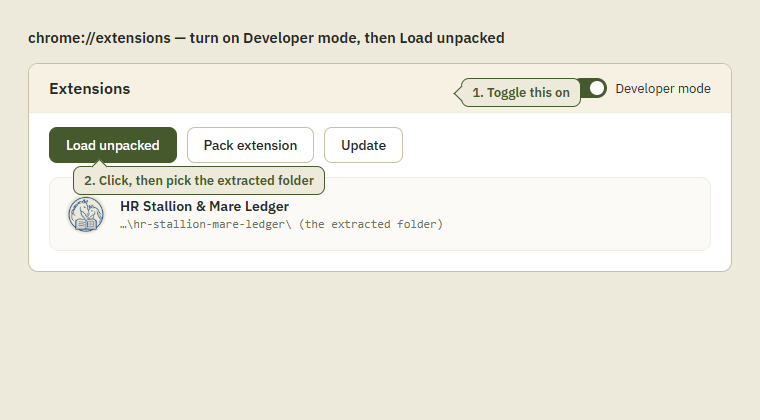
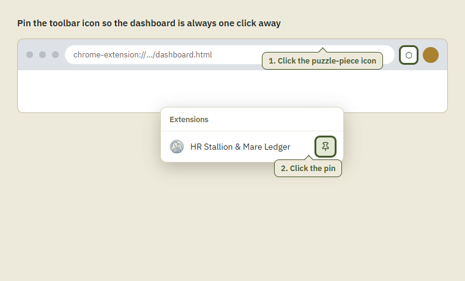
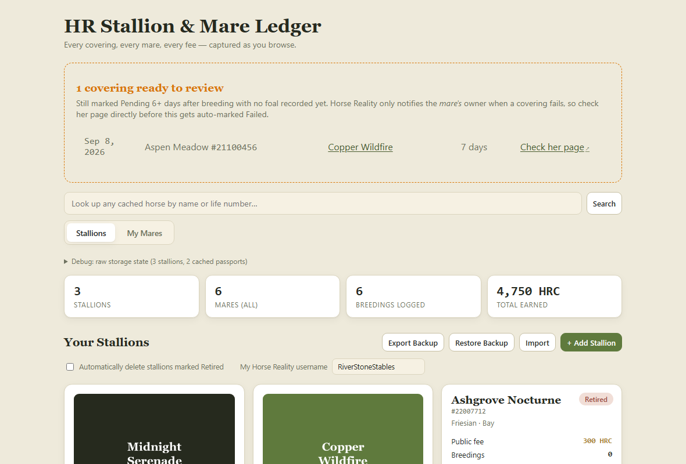
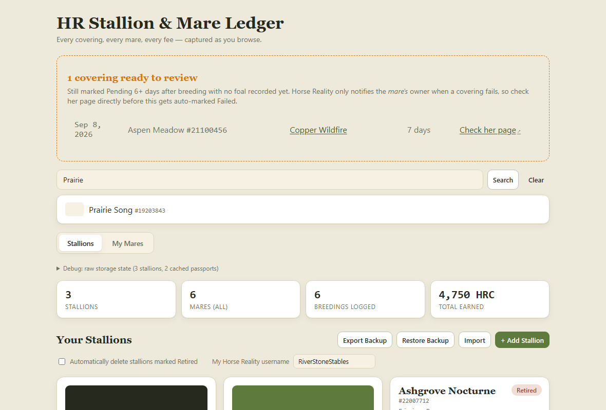
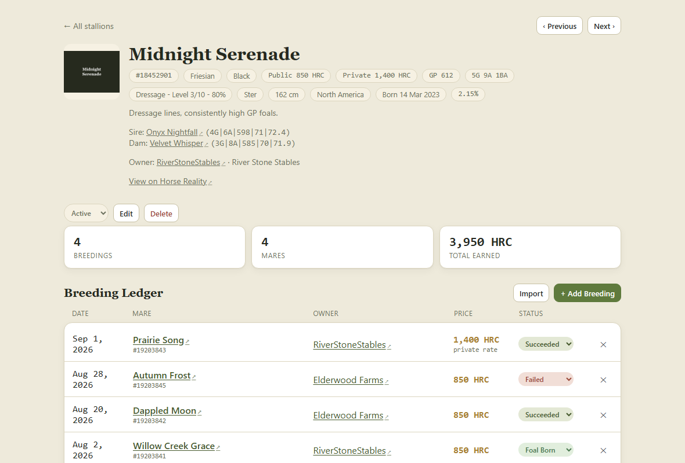
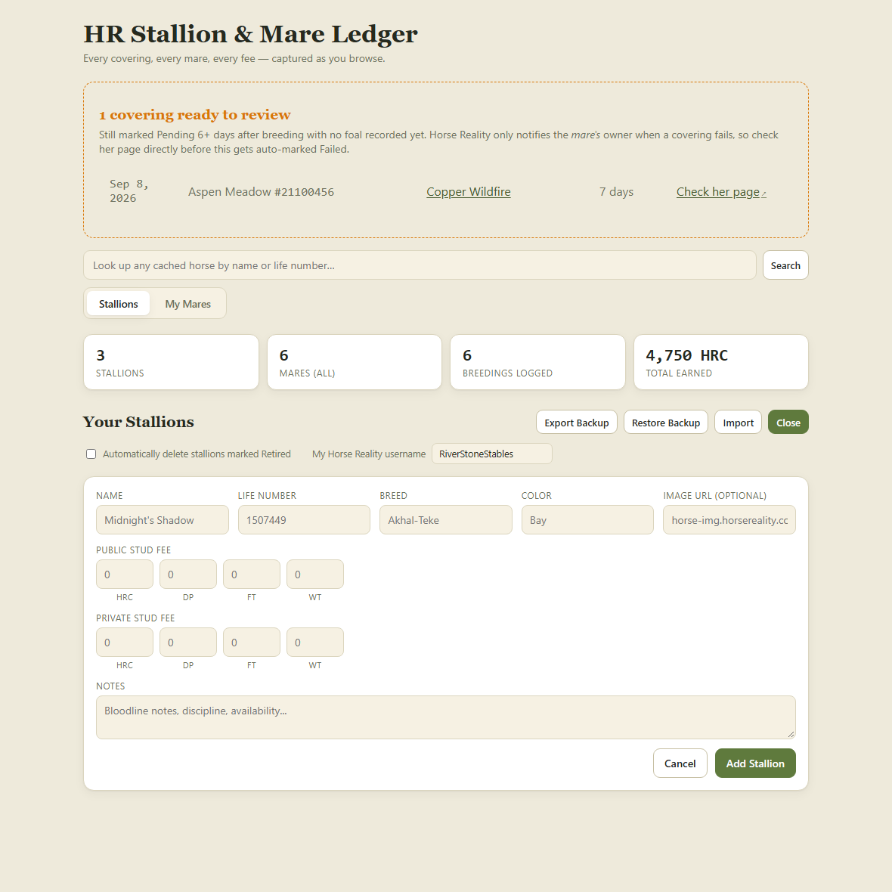
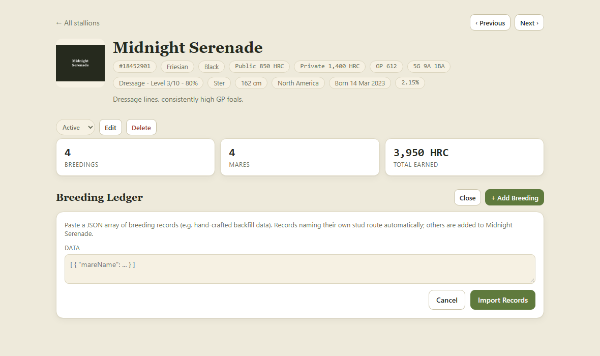
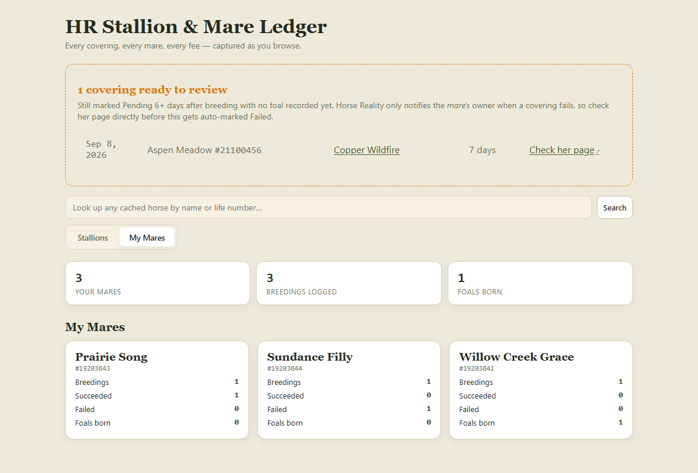
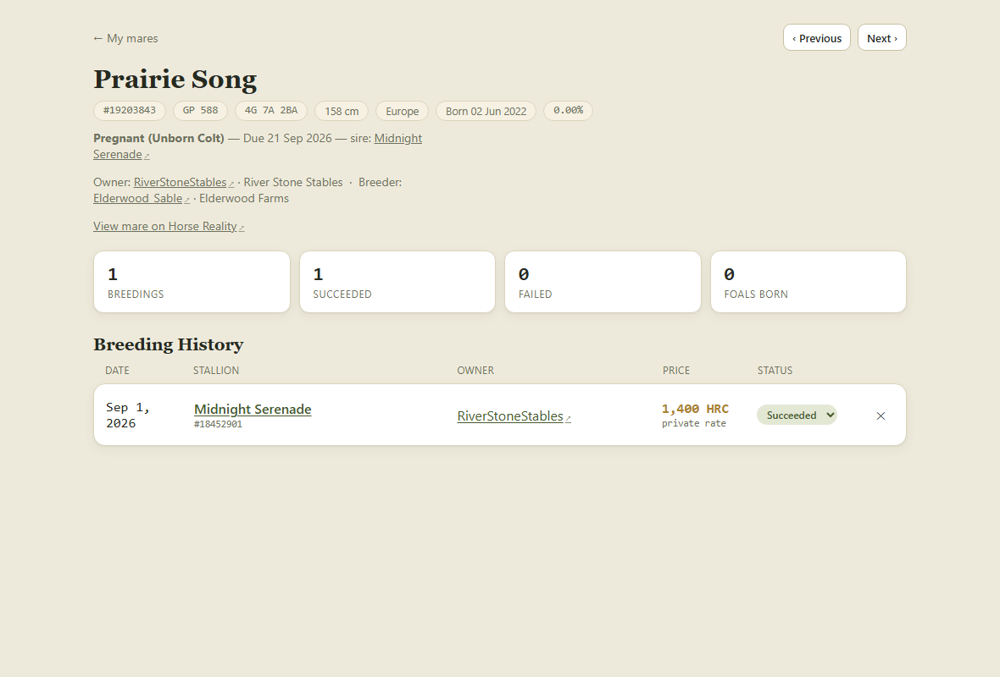
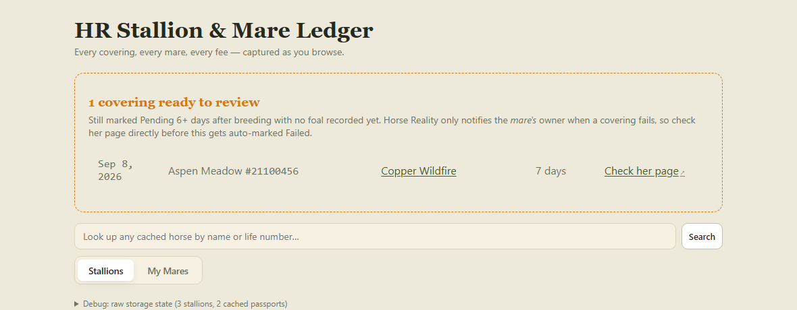

# HR Stallion & Mare Ledger — User Manual

A visual walkthrough of installing and using the extension. For a quick technical overview instead, see the [main README](../README.md).

> The dashboard screenshots below use fictional sample data (no real player or horse names) so this manual can be published safely.

## Contents

1. [Installing](#installing)
2. [Pin the toolbar icon](#pin-the-toolbar-icon)
3. [First-time setup](#first-time-setup)
4. [Your Stallions](#your-stallions)
5. [Looking up any horse](#looking-up-any-horse)
6. [A stallion's detail page](#a-stallions-detail-page)
7. [Adding a stallion by hand](#adding-a-stallion-by-hand)
8. [Bulk-importing breeding records](#bulk-importing-breeding-records)
9. [My Mares](#my-mares)
10. [A mare's detail page & pregnancy tracking](#a-mares-detail-page--pregnancy-tracking)
11. [Understanding breeding statuses](#understanding-breeding-statuses)
12. [Reviewing coverings before they auto-fail](#reviewing-coverings-before-they-auto-fail)
13. [Updating](#updating)
14. [Privacy](#privacy)
15. [Troubleshooting](#troubleshooting)

## Installing

1. On the [repository page](https://github.com/GoodaleEnt/hr-stallion-mare-ledger), click the green **Code** button, then **Download ZIP**.
2. Extract the ZIP somewhere you'll keep it — Chrome loads the extension directly from this folder, so don't delete or move it later.
3. Open `chrome://extensions` in Chrome.
4. Turn on **Developer mode**, then click **Load unpacked** and select the extracted folder (the one containing `manifest.json`).

## Pin the toolbar icon

Chrome hides new extension icons behind the puzzle-piece menu by default. Pin it so the dashboard is always one click away:

## First-time setup

Open the dashboard (click the toolbar icon) and enter your Horse Reality username under **"My Horse Reality username"** on the Stallions tab. This is how the extension tells *your* horses apart from everyone else's — without it, "My Mares" stays empty and owned horses won't auto-track.

## Your Stallions

This is the dashboard's home view. As you browse Horse Reality, stallions you own are tracked here automatically — no manual entry needed for a horse you own, though you can always add one by hand (see below).

Each stallion card shows his public/private stud fee, how many breedings are logged, and total earnings. A stat bar across the top rolls all of this up across your whole roster.

**How stallions get added automatically:**
- A bank transaction where you *earned* a stud fee (proves you own the stud)
- Viewing your own horse's page, when its owner matches the username you set above

Studs that show up here only because they were needed to track one of *your mares'* breedings with someone else's stallion are kept off this grid — they still show up wherever that mare's history is displayed.

**Export Backup / Restore Backup** (top of this tab) save or reload your *entire* ledger as a single JSON file — every stallion, mare, breeding record, and cached horse passport. Use it before doing anything risky (switching computers, clearing browser data), or just periodically for peace of mind. Restoring a backup replaces everything currently stored, so you'll be asked to confirm first.

## Looking up any horse

The search box (top of every list view) looks up *any* horse the extension has ever cached a passport snapshot for — by name or life number — even if that horse isn't tied to a tracked stallion or a logged breeding yet.

Clicking a result opens a lightweight passport view: genetics, pedigree, and pregnancy status, pulled straight from Horse Reality's own data the moment you last viewed that horse's page.

## A stallion's detail page

Click any stallion card to see his full breeding ledger.

This page shows:
- **Genetics & pedigree** — genetic potential, conformation, tested colours, training, COI, and sire/dam (stacked, each linking back to Horse Reality)
- **A link to view him on Horse Reality** directly
- **Prev / Next** buttons to flip through your whole roster without going back to the list
- **The full breeding ledger** — every mare bred to him, her owner, the price paid, and status
- **Edit / Delete / status** controls, and buttons to add a breeding by hand or bulk-import a JSON backfill

## Adding a stallion by hand

Anything the auto-capture misses can be entered manually — useful for backfilling history from before you installed the extension.

## Bulk-importing breeding records

Both a stallion's detail page and the Stallions tab have an **Import** button, for pasting in a JSON array of breeding records all at once — handy for backfilling history from before you installed the extension, or migrating from a spreadsheet.

A record naming its own stud (`stallionName` or `stallionLifeNumber`) routes to that stallion automatically — but only if he's already in your ledger; records for a stud that isn't are skipped, and you're told which ones so you can add him first. Anything that doesn't name a stud goes to whichever stallion's page you opened Import from. A record that matches an existing one (same mare, date, foal, and price) updates it in place instead of duplicating.

## My Mares

Switch to the **My Mares** tab to see every mare *you* own — scoped by the username you set in first-time setup. A mare appears here the moment you view her page, even before she's been bred; once she has breeding history, it shows too.

## A mare's detail page & pregnancy tracking

Click any mare to see her full picture, including live pregnancy status if she's currently carrying.

While she's pregnant, you'll see her due date and the covering sire (linked), pulled directly from her passport the moment you last viewed her page — no manual entry needed.

## Understanding breeding statuses

| Status | Meaning |
|---|---|
| **Pending** | A covering was logged (bank transaction or notification), outcome not yet known |
| **Succeeded** | Confirmed pregnant — captured from the mare's own pregnancy status |
| **Failed** | Confirmed not pregnant |
| **Foal Born** | A foal resulting from this covering has arrived, captured from the stallion's Offspring tab |

**A note on failures:** Horse Reality only sends the "covering has failed" notification to the *mare's* owner, never the stud's — so if you're a stud owner, you'd normally never find out a customer's mare didn't take. To cover this gap, the extension automatically marks a "Pending" record **Failed** once it's more than 6 days old with no matching foal for that mare — Horse Reality resolves a covering within about that window, so a longer silence almost always means it didn't take.

You can also change any record's status by hand at any time using the dropdown in its row.

## Reviewing coverings before they auto-fail

Since that 6-day auto-fail happens quietly the next time you're browsing Horse Reality, it's easy to miss — and you'd have no way to double-check it before it happens. So as soon as a "Pending" covering crosses the 6-day mark, it's surfaced at the top of both the Stallions and My Mares tabs, and the toolbar icon badges with a count — even if you haven't opened Horse Reality that day.

Each row links straight to **her page on Horse Reality** — since the failure notification went to her, not you, that's the only place to actually check what happened. From there you can either leave it for the automatic sweep to mark Failed, or jump to the stallion's page and set the status yourself once you know.

## Updating

**Your data is safe as long as you update in place.** Chrome ties an unpacked extension's stored data to the folder it's loaded from, not its contents:

1. Re-download the ZIP and extract it **into the same folder**, overwriting the old files — never a new or different folder.
2. Click the reload icon (⟳) on the extension's card at `chrome://extensions`.
3. If Chrome shows a new-permissions warning, accept it — reloading never clears your data.

**Never click "Remove"** to update — that permanently deletes the extension's stored data, even if you reload it from the same folder right after. If you want a safety net regardless, use **Export Backup** / **Restore Backup** on the dashboard (see below).

## Privacy

Everything lives in `chrome.storage.local` inside your own browser profile and never leaves your machine, except for requests the extension itself makes to `horsereality.com`/`v2.horsereality.com` — the same site you're already using — to read pages and fetch horse data. There is no backend, no account, and no analytics. See the [full privacy policy](../README.md#privacy) for details.

## Troubleshooting

- **Nothing is showing up.** Make sure you've set your username in Settings (Stallions tab) — most auto-tracking depends on matching it against a horse's owner.
- **A stallion I don't own is cluttering things.** If it only exists to anchor one of your mares' breeding history with an outside stud, it's intentionally kept off the Stallions grid — check that mare's own detail page instead.
- **Data seems stale after a Horse Reality update.** The extension reads Horse Reality's own API and page content directly; if the site changes its markup or API shape, some captures may need an update. Open an issue on the [GitHub repository](https://github.com/GoodaleEnt/hr-stallion-mare-ledger/issues) if something stops working.
