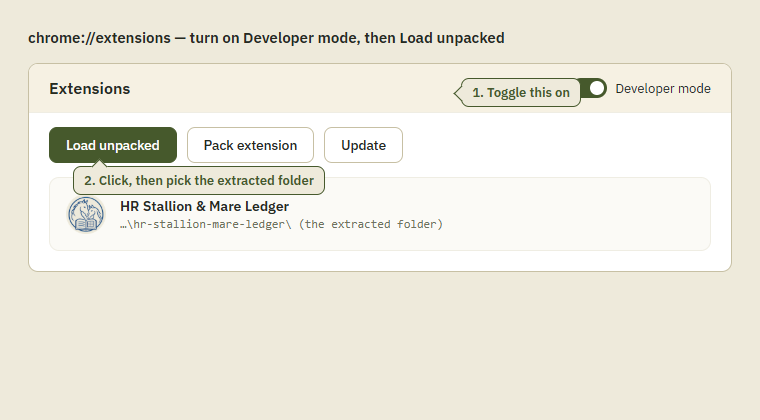
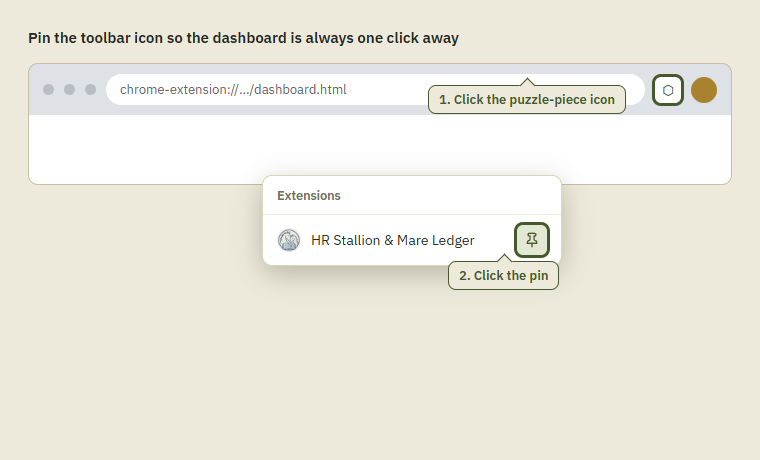
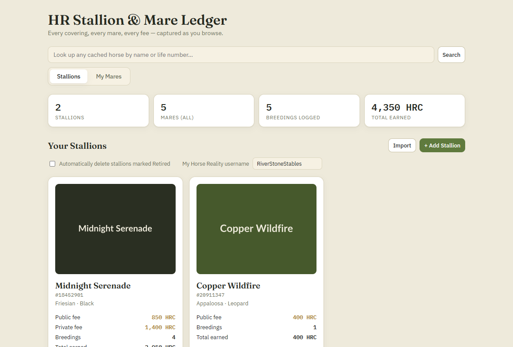
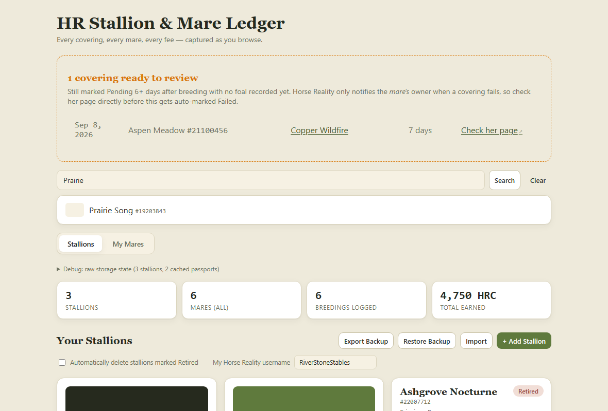
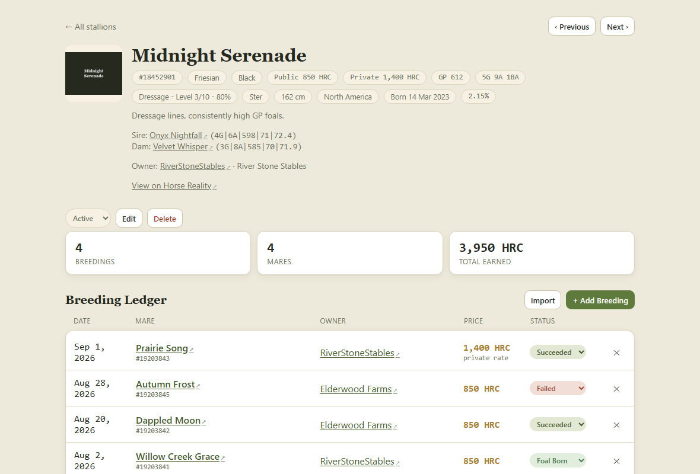
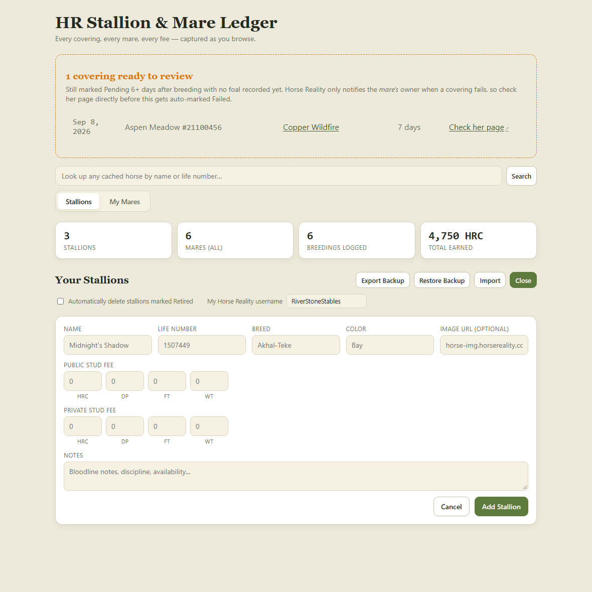
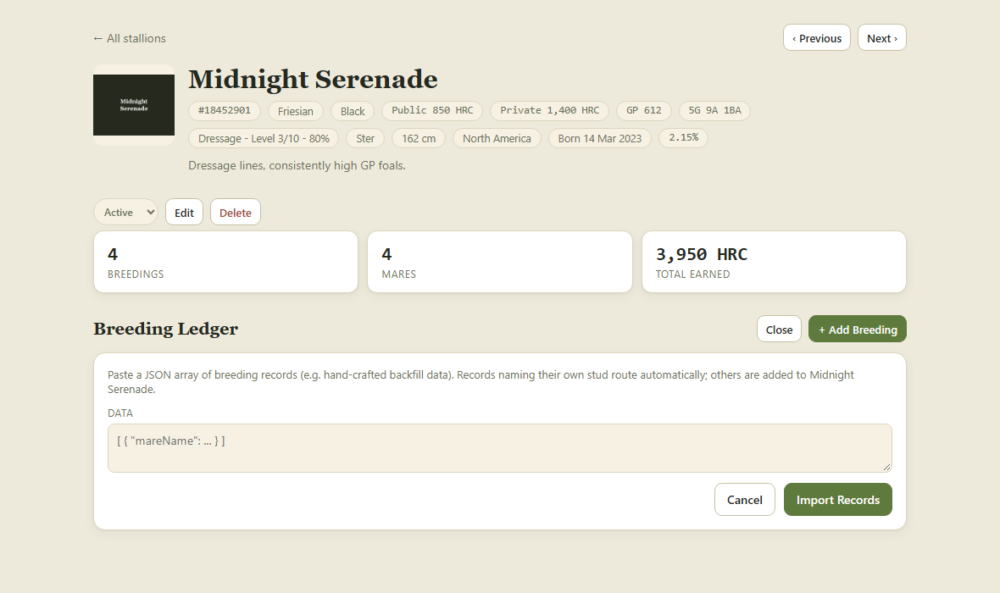
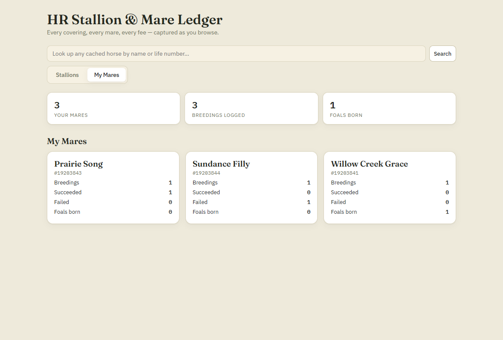
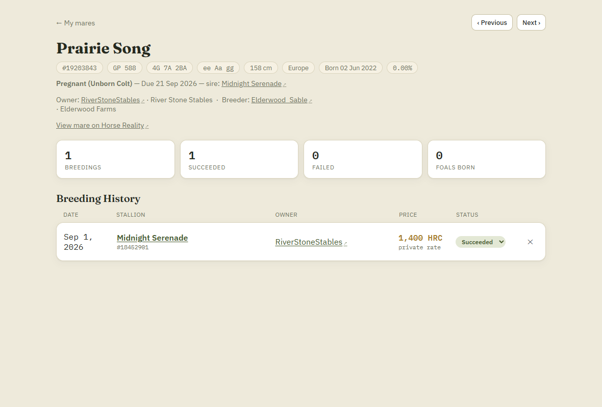
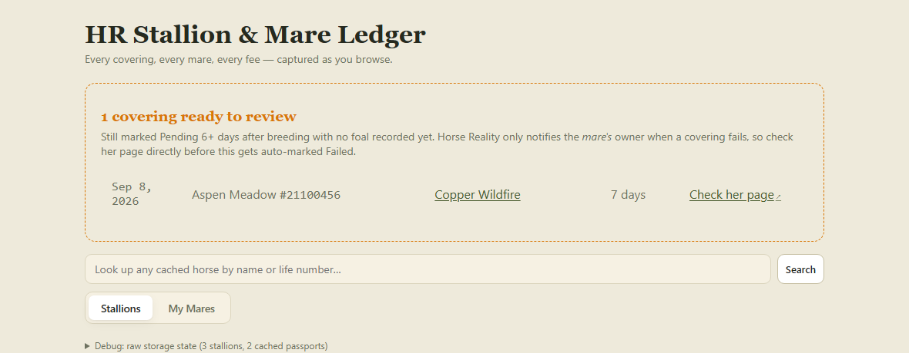

# HR Stallion & Mare Ledger — User Manual

A visual walkthrough of installing and using the extension. For a quick technical overview instead, see the [main README](../README.md).

> The dashboard screenshots below use fictional sample data (no real player or horse names) so this manual can be published safely.

## Contents

1. [Installing](#installing)
2. [Pin the toolbar icon](#pin-the-toolbar-icon)
3. [First-time setup](#first-time-setup)
4. [Your Stallions](#your-stallions)
5. [Looking up any horse](#looking-up-any-horse)
6. [A stallion's detail page](#a-stallions-detail-page)
7. [Adding a stallion by hand](#adding-a-stallion-by-hand)
8. [Bulk-importing breeding records](#bulk-importing-breeding-records)
9. [My Mares](#my-mares)
10. [A mare's detail page & pregnancy tracking](#a-mares-detail-page--pregnancy-tracking)
11. [My Herd](#my-herd)
12. [Other Horses](#other-horses)
13. [Foal Calculator](#foal-calculator)
14. [Understanding breeding statuses](#understanding-breeding-statuses)
15. [Reviewing coverings before they auto-fail](#reviewing-coverings-before-they-auto-fail)
16. [Updating](#updating)
17. [Privacy](#privacy)
18. [Troubleshooting](#troubleshooting)

## Installing

1. On the [repository page](https://github.com/GoodaleEnt/hr-stallion-mare-ledger), click the green **Code** button, then **Download ZIP**.
2. Extract the ZIP somewhere you'll keep it — Chrome loads the extension directly from this folder, so don't delete or move it later.
3. Open `chrome://extensions` in Chrome.
4. Turn on **Developer mode**, then click **Load unpacked** and select the extracted folder (the one containing `manifest.json`).

## Pin the toolbar icon

Chrome hides new extension icons behind the puzzle-piece menu by default. Pin it so the dashboard is always one click away:

## First-time setup

Open the dashboard (click the toolbar icon) and enter your Horse Reality username under **"My Horse Reality username"** on the Stallions tab. This is how the extension tells *your* horses apart from everyone else's — without it, "My Mares" stays empty and owned horses won't auto-track.

## Your Stallions

This is the dashboard's home view. As you browse Horse Reality, stallions you own are tracked here automatically — no manual entry needed for a horse you own, though you can always add one by hand (see below).

Each stallion card shows his public/private stud fee, how many breedings are logged, and total earnings. A stat bar across the top rolls all of this up across your whole roster.

**How stallions get added automatically:**
- A bank transaction where you *earned* a stud fee (proves you own the stud)
- Viewing your own horse's page, when its owner matches the username you set above

Studs that show up here only because they were needed to track one of *your mares'* breedings with someone else's stallion are kept off this grid — they still show up wherever that mare's history is displayed.

**Export Backup / Restore Backup** (top of this tab) save or reload your *entire* ledger as a single JSON file — every stallion, mare, breeding record, and cached horse passport. Use it before doing anything risky (switching computers, clearing browser data), or just periodically for peace of mind. Restoring a backup replaces everything currently stored, so you'll be asked to confirm first.

## Looking up any horse

The search box (top of every list view) looks up *any* horse the extension has ever cached a passport snapshot for — by name or life number — even if that horse isn't tied to a tracked stallion or a logged breeding yet.

Clicking a result opens a lightweight passport view: genetics, pedigree, and pregnancy status, pulled straight from Horse Reality's own data the moment you last viewed that horse's page.

## A stallion's detail page

Click any stallion card to see his full breeding ledger.

This page shows:
- **Genetics & pedigree** — genetic potential, conformation, tested colours, training, COI, and sire/dam (stacked, each linking back to Horse Reality)
- **A link to view him on Horse Reality** directly
- **Prev / Next** buttons to flip through your whole roster without going back to the list
- **The full breeding ledger** — every mare bred to him, her owner, the price paid, and status
- **Edit / Delete / status** controls, and buttons to add a breeding by hand or bulk-import a JSON backfill

## Adding a stallion by hand

Anything the auto-capture misses can be entered manually — useful for backfilling history from before you installed the extension.

## Bulk-importing breeding records

Both a stallion's detail page and the Stallions tab have an **Import** button, for pasting in a JSON array of breeding records all at once — handy for backfilling history from before you installed the extension, or migrating from a spreadsheet.

A record naming its own stud (`stallionName` or `stallionLifeNumber`) routes to that stallion automatically — but only if he's already in your ledger; records for a stud that isn't are skipped, and you're told which ones so you can add him first. Anything that doesn't name a stud goes to whichever stallion's page you opened Import from. A record that matches an existing one (same mare, date, foal, and price) updates it in place instead of duplicating.

## My Mares

Switch to the **My Mares** tab to see every mare *you* own — scoped by the username you set in first-time setup. A mare appears here the moment you view her page, even before she's been bred; once she has breeding history, it shows too.

## A mare's detail page & pregnancy tracking

Click any mare to see her full picture, including live pregnancy status if she's currently carrying.

While she's pregnant, you'll see her due date and the covering sire (linked), pulled directly from her passport the moment you last viewed her page — no manual entry needed.

## My Herd

The **My Herd** tab lists every horse you own that the extension has seen (it uses the same username match as My Mares). For each one you can set:

- **Role** — Broodmare, Public Stud, Private Stud, Public & Private Stud, Competition or Young Stock
- **Status** — Active, Observation, Companion, For Sale, Sold, Retired or Deceased
- **Project** — a free-text group name for a breeding goal (e.g. "Leopard line"); use the filters above the list to view one role or project at a time
- **Show scores** — the highest conformation show score is captured automatically whenever you open a horse's stats page (it reads the "Latest 25 show results" list, skipping breed-type shows) and is **only ever raised**, so it stays even after that score drops off the 25-show list. If you also use the HRToolkit extension, its "All-time Confo" figure is read too. You can still type earlier scores separated by commas (e.g. `84.2, 91.5, 77`) for results the page no longer shows; the best of everything is displayed, for example "Best 91.5 · from stats page". Horse Reality's conformation grades (like "2G 9A 1BA") are shown under each horse's details automatically.

When you buy a horse, the price and transport fee are picked up automatically the next time you open your Horse Reality **bank page** (the "You have bought…" row). You can also open "Purchase price & shipping" on a horse's page to enter or correct what you paid and the shipping fee (each with its own currency); figures you typed yourself are never overwritten by the automatic ones. They show as **Paid / Shipping / Total** tags on the horse's page and as rows on its Stallions or My Mares card, and under its name in My Herd. Leave them empty for horses you bred.

Each horse also has a **200 × 200 picture** beside it (a "No picture yet" tile until one has been saved).

Horses marked **Sold, Retired or Deceased** move out of the working list and the headline numbers into an archive — click **Show archive** to see them. The tiles at the top summarise your active herd: size, mares, stallions, mares in foal, foals born, number of breeds and average genetic potential. You can also set the same three tags from a horse's own page (click her name). These tags are separate from a tracked stallion's Active/Sold/Retired status on the Stallions tab.

### High scores and Breed Total

Each horse's card and page shows its **top conformation score** and its **Breed Total (BT)**, with when each was reached. The conformation high is read from the horse's stats page (the show results list, with the show date when the page gives one) and only ever goes up, so it stays after the score drops off the latest-25 list. **Breed Total = ((Genetic Potential ÷ 10) + Top Conformation Score) ÷ 2**, and its high score is kept the same way. A date shown as "seen" means the ledger first noticed the score that day because the page didn't give the show date.

### Retired and sold horses

Set a horse's **Status** to **Retired** (on My Herd, on a mare's card or page, on its own page, or on a stallion's status menu) and it leaves the Stallions, My Mares, Colts & Fillies and My Herd lists and appears on the **Retired** tab instead. Set a horse's status to **Sold** and it moves to **Other Horses**, tagged *Sold*. Nothing is deleted: change the status back to Active (or press **Restore** on a sold horse) and it returns to its usual place. A retired stallion's earnings still count in your totals.

### Highlight goals

Under the search box, open **Highlight goals** and fill in any of: a minimum top conformation score, a minimum Breed Total, and a maximum number of conformation traits at each of these ratings: **G+** (Good+), **G** (Good), **A** (Average) and **BA** (Below average). There's no limit for Very good (VG), since you always want as many of those as possible. Leave a box empty to ignore it.

Every horse card, herd row and horse page then shows three labelled boxes above its picture: **Conformation**, **Breed Total** and **Conformation traits**. A box is green if the horse meets that goal, red if it doesn't, and grey if there's no goal set or no data yet. A horse that meets every goal you set is outlined. Trait limits are "at or under": a maximum of 2 BA traits accepts horses with 0, 1 or 2.

## Other Horses

When you open a horse on Horse Reality that **isn't yours**, a small box appears in the bottom-right corner asking whether to add it to your ledger (this needs your username set in Settings, so the extension can tell your horses from other people's).

- **Add to ledger** puts the horse on the **Other Horses** tab. It stays out of My Herd, My Mares and the Stallions tab, so your own numbers aren't affected.
- **No thanks** remembers your answer, and the box won't ask about that horse again.

The Other Horses tab shows each added horse with its picture, breed, sex and owner. Click a name to open its passport, or search for it in the box at the top of any tab (added horses are tagged "Other Horses" in the results). **Remove** takes a horse off the tab but keeps it searchable; the box may appear again the next time you open its page.

## Foal Calculator

Pick a **mare** and a **stallion** from any horses whose pages you've visited (the lists are grouped into 3 and older, then under 3, with your own horses first in each group) and the **Foal Calculator** shows the average of their genetic potential and checks both pedigrees for shared ancestors up to three generations behind each parent. If any turn up, it lists them with how far back they sit on each side and gives an *estimated* inbreeding percentage (an estimate that ignores the ancestors' own inbreeding, so Horse Reality's figure can be higher).

Once both parents are chosen, each is shown as a card with its picture, breed, genetic potential and tested colours. A **Parent stats** table then compares genetic potential, conformation grades, best conformation show score, inbreeding (COI), height, age, breed, location and training, and a **Conformation traits** table compares each of the 12 traits (Walk, Trot, Canter, Gallop, Posture, Head, Neck, Back, Shoulders, Frontlegs, Hindquarters, Socks) as Good / Average / Below average. Rows where the parents differ are highlighted with ≠, and ▲ marks the stronger parent. Trait ratings are read from each horse's own page the first time you open it on Horse Reality. A **Foal pedigree** tree follows (sire on top, dam below, going back as far as the cached pedigrees reach). Any ancestor that appears on both sides is outlined in red.

The check only knows what has been cached. If some ancestors haven't been visited it says **Pedigree incomplete** and lists them — open those horses' pages on Horse Reality to fill the gaps, rather than treating a missing result as "not inbred". 

### Colour possibilities

Below the inbreeding check, the calculator shows the odds for the foal's **coat colour** (for example Bay 56.3%, Chestnut 25%, Black 18.8%) and **Appaloosa pattern**, plus a collapsible gene-by-gene breakdown. Each parent passes on one copy of every gene with equal chance, and the genes are treated as independent.

- Only genes that are known on **both** parents are used. The extension reads the genes Horse Reality shows under "tested colours" (E, A, G, CR, D, LP, PATN1, SW1, W20); anything else is listed as "not known" instead of being guessed.
- **Enter extra genes by hand:** set Sooty, Silver, Flaxen, Champagne, Roan, Tobiano or Sabino for a horse if you know them, either under "Extra genes" on the horse's own page (a stallion's page, a mare's page or any cached horse) or in the calculator itself. Genes are saved on the horse, so you enter them once and every future pairing uses them automatically. They also appear with the horse's other genetics (next to its tested colours) on its page and in the calculator's parent cards. They're also included in backups. If Horse Reality itself ever reports one of these genes for a horse, its value is used and the box is locked.
- Extra genes are part of the **Coat colour** list (for example "Bay Sooty 42.2%"). Any extra gene you haven't set counts as **not present** on that parent (the "Not present (default)" option), so you only need to enter genes a horse actually carries. If the base colour gene (E) isn't tested on both parents, the list still combines the other known genes under "Base colour unknown". An **Extra genes** card lists the chance the foal shows each hand-entered gene (for example Sooty 75%) with the genotype split beneath it; it appears even when the combined coat-colour list can't be built. Colour names follow standard equine genetics (for example Silver only shows on black-based coats and Flaxen only on chestnuts); Horse Reality may label some combinations differently.

## Breeding dates

When you click **Breed** on Horse Reality's Breed page, the ledger records the covering with today's date (shown as **Date bred**) and the status *Pending*, unless the site shows an error. The foal's **Date born** is filled in from the foal's passport once it's born.

## Understanding breeding statuses

| Status | Meaning |
|---|---|
| **Pending** | A covering was logged (bank transaction or notification), outcome not yet known |
| **Succeeded** | Confirmed pregnant — captured from the mare's own pregnancy status |
| **Failed** | Confirmed not pregnant |
| **Foal Born** | A foal resulting from this covering has arrived, captured from the stallion's Offspring tab |

**A note on failures:** Horse Reality only sends the "covering has failed" notification to the *mare's* owner, never the stud's — so if you're a stud owner, you'd normally never find out a customer's mare didn't take. To cover this gap, the extension automatically marks a "Pending" record **Failed** once it's more than 6 days old with no matching foal for that mare — Horse Reality resolves a covering within about that window, so a longer silence almost always means it didn't take.

You can also change any record's status by hand at any time using the dropdown in its row.

## Reviewing coverings before they auto-fail

Since that 6-day auto-fail happens quietly the next time you're browsing Horse Reality, it's easy to miss — and you'd have no way to double-check it before it happens. So as soon as a "Pending" covering crosses the 6-day mark, it's surfaced at the top of both the Stallions and My Mares tabs, and the toolbar icon badges with a count — even if you haven't opened Horse Reality that day.

Each row links straight to **her page on Horse Reality** — since the failure notification went to her, not you, that's the only place to actually check what happened. From there you can either leave it for the automatic sweep to mark Failed, or jump to the stallion's page and set the status yourself once you know.

## Updating

**Your data is safe as long as you update in place.** Chrome ties an unpacked extension's stored data to the folder it's loaded from, not its contents:

1. Re-download the ZIP and extract it **into the same folder**, overwriting the old files — never a new or different folder.
2. Click the reload icon (⟳) on the extension's card at `chrome://extensions`.
3. If Chrome shows a new-permissions warning, accept it — reloading never clears your data.

**Never click "Remove"** to update — that permanently deletes the extension's stored data, even if you reload it from the same folder right after. If you want a safety net regardless, use **Export Backup** / **Restore Backup** on the dashboard (see below).

## Privacy

Everything lives in `chrome.storage.local` inside your own browser profile and never leaves your machine, except for requests the extension itself makes to `horsereality.com`/`v2.horsereality.com` — the same site you're already using — to read pages and fetch horse data. There is no backend, no account, and no analytics. See the [full privacy policy](../README.md#privacy) for details.

## Troubleshooting

- **Nothing is showing up.** Make sure you've set your username in Settings (Stallions tab) — most auto-tracking depends on matching it against a horse's owner.
- **A stallion I don't own is cluttering things.** If it only exists to anchor one of your mares' breeding history with an outside stud, it's intentionally kept off the Stallions grid — check that mare's own detail page instead.
- **Data seems stale after a Horse Reality update.** The extension reads Horse Reality's own API and page content directly; if the site changes its markup or API shape, some captures may need an update. Open an issue on the [GitHub repository](https://github.com/GoodaleEnt/hr-stallion-mare-ledger/issues) if something stops working.
