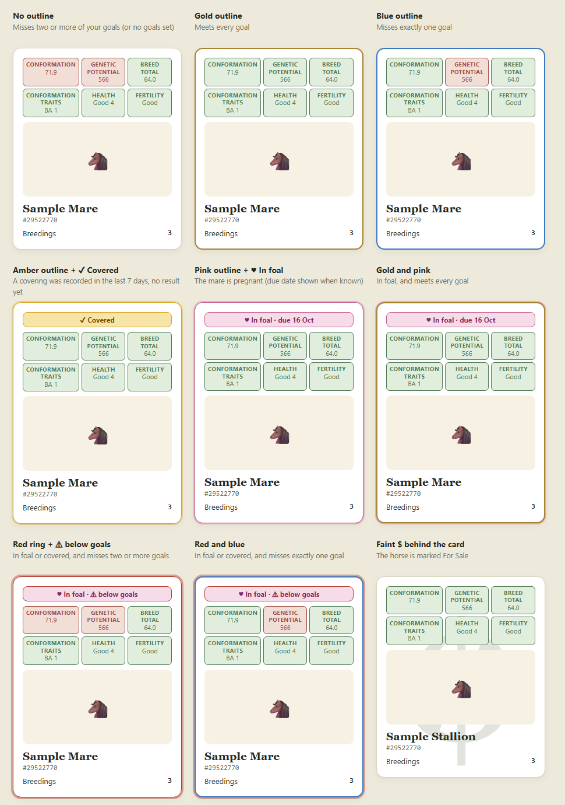

# HR Stallion & Mare Ledger — User Manual

A visual walkthrough of installing and using the extension. For a quick technical overview instead, see the [main README](../README.md).

> The dashboard screenshots below use fictional sample data (no real player or horse names) so this manual can be published safely.

## Contents

1. [Installing](#installing)
2. [Pin the toolbar icon](#pin-the-toolbar-icon)
3. [First-time setup](#first-time-setup)
4. [Your Stallions](#your-stallions)
5. [The Open in Ledger button](#the-open-in-ledger-button)
6. [Looking up any horse](#looking-up-any-horse)
7. [A stallion's detail page](#a-stallions-detail-page)
8. [Adding a stallion by hand](#adding-a-stallion-by-hand)
9. [Bulk-importing breeding records](#bulk-importing-breeding-records)
10. [My Mares](#my-mares)
11. [A mare's detail page & pregnancy tracking](#a-mares-detail-page--pregnancy-tracking)
12. [My Herd](#my-herd) (high scores, sales, retired horses, highlight goals)
13. [Handy extras](#handy-extras)
14. [Separate goals for mares and stallions](#separate-goals-for-mares-and-stallions)
15. [Goal suggestions](#goal-suggestions)
16. [Breeding calendar, money and more](#breeding-calendar-money-and-more)
17. [Times, ages and the game's rules](#times-ages-and-the-games-rules)
18. [Breed picker on every page and best disciplines](#breed-picker-on-every-page-and-best-disciplines)
19. [Show results](#show-results)
20. [Removing a horse](#removing-a-horse)
21. [Other Horses](#other-horses)
22. [Analytics](#analytics)
23. [Sell ideas](#sell-ideas)
24. [Breeding suggestions](#breeding-suggestions)
25. [Foal Calculator](#foal-calculator)
26. [Foals, covered mares and breeding dates](#foals)
27. [Understanding breeding statuses](#understanding-breeding-statuses)
28. [Reviewing coverings before they auto-fail](#reviewing-coverings-before-they-auto-fail)
29. [Updating](#updating)
30. [Privacy](#privacy)
31. [Troubleshooting](#troubleshooting)
32. [Notes the suggestions use](#notes-the-suggestions-use)
33. [Mares that out-produce themselves](#mares-that-out-produce-themselves)
34. [Preferred genetics](#preferred-genetics)
35. [Fit summary on Horse Reality pages](#fit-summary-on-horse-reality-pages)
36. [Purchase criteria](#purchase-criteria)
37. [Market board colours](#market-board-colours)
38. [Listing, retiring and selling a horse](#listing-retiring-and-selling-a-horse)
39. [Card colours at a glance](#card-colours-at-a-glance)
40. [Tags, partners and other tools](#tags-partners-and-other-tools)

## Installing

1. On the [repository page](https://github.com/GoodaleEnt/hr-stallion-mare-ledger), click the green **Code** button, then **Download ZIP**.
2. Extract the ZIP somewhere you'll keep it — Chrome loads the extension directly from this folder, so don't delete or move it later.
3. Open `chrome://extensions` in Chrome.
4. Turn on **Developer mode**, then click **Load unpacked** and select the extracted folder (the one containing `manifest.json`).

## Pin the toolbar icon

Chrome hides new extension icons behind the puzzle-piece menu by default. Pin it so the dashboard is always one click away:

## First-time setup

Open the dashboard (click the toolbar icon) and enter your Horse Reality username under **"My Horse Reality username"** on the Stallions tab. This is how the extension tells *your* horses apart from everyone else's — without it, "My Mares" stays empty and owned horses won't auto-track.

## Your Stallions

This is the dashboard's home view. As you browse Horse Reality, stallions you own are tracked here automatically — no manual entry needed for a horse you own, though you can always add one by hand (see below).

The row of tiles at the top counts your **Active stallions, Active mares, Active colts and Active fillies** (retired and sold horses are left out), with **Breedings logged** and **Total earned**. Under each of the four counts, if you have set highlight goals, are three lines: how many **fit your goals**, how many are **off by one** goal box and how many are **off by more**. The **Breed** picker under the tabs limits everything to one breed, and the **Filter** box hides cards that do not match what you type.

Each stallion card shows his public/private stud fee, how many breedings are logged, and total earnings. A stat bar across the top rolls all of this up across your whole roster.

**How stallions get added automatically:**
- A bank transaction where you *earned* a stud fee (proves you own the stud)
- Viewing your own horse's page, when its owner matches the username you set above

Studs that show up here only because they were needed to track one of *your mares'* breedings with someone else's stallion are kept off this grid — they still show up wherever that mare's history is displayed.

**Export Backup / Restore Backup** (top of this tab) save or reload your *entire* ledger as a single JSON file — every stallion, mare, breeding record, and cached horse passport. Use it before doing anything risky (switching computers, clearing browser data), or just periodically for peace of mind. Restoring a backup replaces everything currently stored, so you'll be asked to confirm first.

## The Open in Ledger button

On every horse's page on Horse Reality there is a white **Open in Ledger** pill inside the horse's picture, in the top-left corner. When the horse has status pills such as *Covered* or *Stud or semen* it sits beside them; when it doesn't, it sits in the same corner on its own. Click it to jump straight to that horse in the ledger: your stallions open on their stallion page, any other horse on its profile (your mares open on their mare page). If the dashboard is already open it is brought to the front instead of opening a second copy. If the ledger hasn't saved that horse yet, the dashboard opens with its life number in the search box. On mobile, the button opens the Ledger overlay on the same horse.

## Looking up any horse

The search box (top of every list view) looks up *any* horse the extension has ever cached a passport snapshot for — by name or life number — even if that horse isn't tied to a tracked stallion or a logged breeding yet.

Clicking a result opens a lightweight passport view: genetics, pedigree, and pregnancy status, pulled straight from Horse Reality's own data the moment you last viewed that horse's page.

## A stallion's detail page

Click any stallion card to see his full breeding ledger.

This page shows:
- **Genetics & pedigree** — genetic potential, conformation, tested colours, training, COI, and sire/dam (stacked, each linking back to Horse Reality)
- **A link to view him on Horse Reality** directly
- **Prev / Next** buttons to flip through your whole roster without going back to the list
- **The full breeding ledger** — every mare bred to him, her owner, the price paid, and status
- **Edit / Delete / status** controls, and buttons to add a breeding by hand or bulk-import a JSON backfill

## Adding a stallion by hand

Anything the auto-capture misses can be entered manually — useful for backfilling history from before you installed the extension.

## Bulk-importing breeding records

Both a stallion's detail page and the Stallions tab have an **Import** button, for pasting in a JSON array of breeding records all at once — handy for backfilling history from before you installed the extension, or migrating from a spreadsheet.

A record naming its own stud (`stallionName` or `stallionLifeNumber`) routes to that stallion automatically — but only if he's already in your ledger; records for a stud that isn't are skipped, and you're told which ones so you can add him first. Anything that doesn't name a stud goes to whichever stallion's page you opened Import from. A record that matches an existing one (same mare, date, foal, and price) updates it in place instead of duplicating.

## My Mares

Switch to the **My Mares** tab to see every mare *you* own — scoped by the username you set in first-time setup. A mare appears here the moment you view her page, even before she's been bred; once she has breeding history, it shows too.

## A mare's detail page & pregnancy tracking

Click any mare to see her full picture, including live pregnancy status if she's currently carrying.

While she's pregnant, you'll see her due date and the covering sire (linked), pulled directly from her passport the moment you last viewed her page — no manual entry needed.

## My Herd

The **My Herd** tab lists every horse you own that the extension has seen (it uses the same username match as My Mares). For each one you can set:

- **Role** — Broodmare, Public Stud, Private Stud, Public & Private Stud, Competition or Young Stock
- **Status** — Active, Observation, Companion, For Sale, Sold, Retired or Deceased
- **Project** — a free-text group name for a breeding goal (e.g. "Leopard line"); use the filters above the list to view one role or project at a time
- **Show scores** — the highest conformation show score is captured automatically whenever you open a horse's stats page (it reads the "Latest 25 show results" list, skipping breed-type shows) and is **only ever raised**, so it stays even after that score drops off the 25-show list. If you also use the HRToolkit extension, its "All-time Confo" figure is read too. You can still type earlier scores separated by commas (e.g. `84.2, 91.5, 77`) for results the page no longer shows; the best of everything is displayed, for example "Best 91.5 · from stats page". Horse Reality's conformation grades (like "2G 9A 1BA") are shown under each horse's details automatically.

When you buy a horse, the price and transport fee are picked up automatically the next time you open your Horse Reality **bank page** (the "You have bought…" row). You can also open "Purchase price & shipping" on a horse's page to enter or correct what you paid and the shipping fee (each with its own currency); figures you typed yourself are never overwritten by the automatic ones. They show as **Paid / Shipping / Total** tags on the horse's page and as rows on its Stallions or My Mares card, and under its name in My Herd. Leave them empty for horses you bred.

**Offers you won.** A bank row "You placed an offer of N HRC on <horse> ... and paid an additional N HRC for transport" counts as the purchase once the horse is yours (an offer that was outbid is not a purchase, so it is kept aside until the horse's page shows you as the owner).

**Purchase rows are read more forgivingly.** The ledger finds the horse as the first link to a horse in the row, ignores words in the horse's own name, reads "for N HRC" as the price and "additional N HRC for transport" as the shipping, and when the wording is not recognised it uses the amount column as the price. If a row that looks like a purchase still cannot be read, a message says so and the row's wording is written to the browser console, so it can be fixed.

**Highest conformation score by hand.** Under **Highest conformation score** on a horse's page (below Purchase price & shipping) you can enter the horse's best score, and optionally the date and show. The stats page only lists recent shows, so a horse with many shows, often one you bought, can have a higher score than the ledger has read. The value is used for Breed Total, rankings and suggestions; a higher score read later from a page replaces it, and clearing the box removes it.

Each horse also has a **200 × 200 picture** beside it (a "No picture yet" tile until one has been saved).

Horses marked **Sold, Retired or Deceased** move out of the working list and the headline numbers into an archive — click **Show archive** to see them. The tiles at the top summarise your active herd: size, mares, stallions, mares in foal, foals born, number of breeds and average genetic potential. You can also set the same three tags from a horse's own page (click her name). These tags are separate from a tracked stallion's Active/Sold/Retired status on the Stallions tab.

### High scores and Breed Total

Each horse's card and page shows its **top conformation score** and its **Breed Total (BT)**, with when each was reached. The conformation high is read from the horse's stats page (the show results list, with the show date when the page gives one) and only ever goes up, so it stays after the score drops off the latest-25 list. **Breed Total = ((Genetic Potential ÷ 10) + Top Conformation Score) ÷ 2**, and its high score is kept the same way. A date shown as "seen" means the ledger first noticed the score that day because the page didn't give the show date.

### Horses for sale

Set a horse's **Status** to **For Sale** (on My Herd, on its own page, or from the status menu on a stallion's or mare's card) and a big faint **$** appears behind its card or row everywhere it is listed, and a gold **$ For sale** tag appears on its profile. The horse stays on all your normal lists. When it is sold, change the status to Sold (or let the bank page do it) and it moves to Other Horses.

### Selling a horse

When you sell a horse, the sale shows on your Horse Reality bank page. The next time you open that page the ledger records what it sold for, the date and the buyer, and marks the horse **Sold** (so it moves to Other Horses). The horse's own page then shows **Sold for …** and, if you recorded what you paid, a **Profit** or **Loss** tag (sale price minus price paid plus shipping, when both use the same currency). You can also open the **Sale** section on a horse's page to enter or correct the price, date or buyer by hand; entering a price marks the horse Sold. Sold horses are left out of the Analytics lists and totals, and the **Sold horses** section at the bottom of Analytics lists them with what they fetched, what they cost and the profit.

### Retired and sold horses

Set a horse's **Status** to **Retired** (on My Herd, on a mare's card or page, on its own page, or on a stallion's status menu) and it leaves the Stallions, My Mares, Colts & Fillies and My Herd lists and appears on the **Retired** tab instead. Set a horse's status to **Sold** and it moves to **Other Horses**, tagged *Sold*. Nothing is deleted: change the status back to Active (or press **Restore** on a sold horse) and it returns to its usual place. A retired stallion's earnings still count in your totals.

### Highlight goals

**Colours:** a horse that meets every goal is outlined in **gold** (on its card or row, and across the top of its own page); a horse that misses **exactly one** goal box is outlined in **blue**. Anything else has no outline. Gold and blue are separate from the pink and amber outlines used for in-foal and covered mares.

Fertility can only be tested from age 3, so for a horse younger than that the Fertility box is greyed ("tested from age 3") and is left out of your goals. Under the search box, open **Highlight goals** and fill in any of: a minimum top conformation score, a minimum Breed Total, and, for conformation traits and for the five vet-check health traits, the **worst rating you will accept** and **how many** may be at that rating (for example, worst = Below average with 2 allows up to two BA traits; worst = Average with 3 allows up to three Average traits and no BA). Nothing may be rated worse than the one you pick. You can also set a **minimum fertility**. Leave a goal on "no limit" to ignore it.

Every horse card, herd row and horse page then shows five labelled boxes above its picture: **Conformation**, **Breed Total**, **Conformation traits**, **Health** and **Fertility**. A box is green if the horse meets that goal, red if it doesn't, and grey if there's no goal set or no data yet. A horse that meets every goal you set is outlined. A **Health** box turns **gold** when more than 3 of the 5 health traits are Excellent, and the **Fertility** box turns gold when fertility is Excellent, whatever your goals say. On a horse's page, each Excellent rating is gold too. Each horse's own page lists its health and fertility ratings once it has had a vet health check (and, for an adult, a fertility test); they are read from the horse's page on Horse Reality. Trait limits are "at or under": a maximum of 2 BA traits accepts horses with 0, 1 or 2.

## Handy extras

- **Breed page links:** on Horse Reality's Breed page, **Open mare ↗** (it follows the mare you pick in the drop-down) and **Open stallion ↗** appear beside the mare selector and open each parent's own page in a new tab.
- **Foal Calculator pages:** each parent's card and every box of the pedigree links to that horse on Horse Reality.
- **Refresh:** the Foal Calculator's **Refresh** button reloads the saved horses and recalculates without clearing the mare and stallion you picked, which are also remembered when you reload the page.
- **Filter box:** every list tab (Stallions, My Mares, Colts, Fillies, My Herd, Retired, Other Horses) has a box under the tabs that hides the horses that don't match what you type (name, breed or status).
- **Open in Foal Calculator:** pairing ideas on Analytics and the stallions on a mare's Breeding suggestions page have a button that opens the Foal Calculator with both parents already chosen.
- **Max stud fee:** the Foal Calculator suggestions have a "Max stud fee (HRC)" box that hides other players' stallions that cost more.
- **Breeding plan:** in the Foal Calculator, add the chosen pairing to your plan and tick it off when it's done.
- **Foal results vs. the parents:** Analytics compares each foal's score with its parents' average top conformation.
- **Mark For Sale:** each Sell ideas row has a button that sets the horse's status to For Sale.
- **Backup reminder:** if you haven't exported a backup for 30 days, a bar at the top offers to export one (or to remind you in a week).

## Separate goals for mares and stallions

In **Highlight goals**, tick **Separate goals for mares & fillies and for stallions & colts** if the two should have different goals. Two buttons then appear: **Mares & fillies** and **Stallions & colts**. Click one to edit that set; a line under them says which set you are editing. Each horse's goal boxes, the "fit your goals" counts, the outlines, Analytics and the goal suggestions then use the goals for its own sex. The foal partner suggestions count a foal as fitting if it would fit either set. Un-tick the box to go back to one set for everyone; your two sets are kept if you tick it again. Saved goal sets keep the whole arrangement.

## Fit summary on Horse Reality pages

When you open a horse's page on Horse Reality, a small card appears in the bottom-left corner of the page saying whether the horse fits your criteria and why. Its colour shows the verdict: **green** (fits), **blue** (off by one), **red** (misses two or more). Click it to open the reasons, each with a ✓ (met), ✗ (missed) or • (not known yet or a note):

- each of your goal boxes (conformation, genetic potential, Breed Total, traits, health, fertility) with the horse's value and your minimum;
- preferred and unwanted genes it carries (and a reminder if its colours have not been tested);
- what your own notes on it say, and for a mare or stallion whether its foals beat their dams.

The **×** hides it for that page, and a checkbox at the bottom of the **My notes** panel turns it off everywhere. It appears a moment after the page loads, once the ledger has saved the horse.

**A horse that is not yours is checked as a purchase.** The card starts "Buying check", uses your **purchase criteria** for the horse's breed (or your goals if you have not set any), and adds whether the horse **would help your herd**: its genetic potential, top conformation and Breed Total against the median and top quarter of your own horses of the same breed, and whether it is strong in the traits your herd is weakest in.

## Purchase criteria

The **Purchase criteria** panel (under My notes, near the top of the dashboard) is where you set what a horse should have for you to buy it. Two drop-downs choose whose criteria you are editing: **Applies to** (mares & fillies, colts & stallions, or both) and **Set for** (all breeds or one breed). So you can ask, for example, for genetic potential 600 and conformation 70 in mares and fillies and 650 and 75 in colts and stallions, for every breed. A field left empty uses the next wider setting: that breed for both sexes, then all breeds for that sex, then all breeds for both. The fields are the same as your goals (minimum genetic potential, top conformation and Breed Total, the **lowest conformation trait rating allowed** and how many traits may sit at it, the worst health rating you accept, minimum fertility) plus the **highest price you will pay** and a list of traits the horse **must be Good or better in**. Your preferred and unwanted genes (set per breed under Preferred genetics) count as well.

**Suggestions from your herd:** once at least three of your horses of that breed are saved, the panel suggests values with an **Apply** button: the level that would put a new horse in the top 40% of your herd (of that sex, when you chose one) for genetic potential, top conformation and Breed Total, and the traits that at least half of your horses are Below average or Average in.

## Ranch page cards: keep or sell, and the best stallion

On your **ranch (estate) page** on Horse Reality, each horse card of yours that is saved in the ledger gets a badge **at the bottom of the card** showing where the horse sits between keeping and selling, compared with the rest of your herd:

- **Level tag and five pips:** **Top keeper** (dark green, 5 pips), **Keep** (green), **Middle of the herd** (olive), **Consider selling** (amber) or **Sell** (red, 1 pip), with the horse's **rank** in its group (for example 12/60). A selling level also shows the asking price the ledger would use; a mare also shows **in foal** or **covered**; a listed horse shows **For sale**.
- **Who it is ranked against:** the same breed and sex (mares & fillies, or colts & stallions), or all breeds of that sex when fewer than 6 of the breed. A group of fewer than 4 shows "Too few to rank".
- **How it is ranked:** a blend of Breed Total, conformation and genetic potential (and your **breeder focus**, which counts more), pulled down by missed goals and unwanted genes, lifted by meeting every goal. A miss of under 1% on a number goal outside your focus is not counted. Notes, a proven producer record, a gene you keep, a stallion's failed coverings and a mare never bred adjust it. A keep note, a proven producer or a keep gene makes a horse a **Top keeper** (shown with a ★, and the pips still follow its real rank); a sell note makes it **Sell**; a horse that meets every goal is never lower than Middle.
- For an adult mare free to breed, an arrow and **the stallion the ledger would pick**, with the foal's estimated Breed Total. Stallions are ranked on the foal's **expected conformation score, genetic potential and conformation stats** (not on Breed Total, which depends on how the foal does in conformation shows); the same ranking is used in the Foal Calculator's partner suggestions and the **Pairing ideas** list on the Analytics tab. A breeder focus counts the matching measure more. The card shows **Yours** (your best stallion) and **Other** (the best-crossing stallion of another player that is saved in the ledger, with his fee, or "no fee saved" when you have not seen one). Hover for your top 5 and the other players' top 5 and why. The **Breeding suggestions** page shows the same two lists. A stallion of another player with no stud fee saved is still offered but marked, because he may not be at stud.

Hover the badge for the rank and every reason. Cards for horses not yet saved in the ledger (open their page once) show nothing. A checkbox in **My notes** turns it off.

## Tags, partners and other tools

### Taglines from HRToolkit on the ranch page

If you use the **HRToolkit** extension, each horse's tagline on your **ranch page** holds numbers the ledger would otherwise need a visit to the horse's page for: for example `3G|6A|3BA|580|64|69.176` (3 Good, 6 Average, 3 Below average traits, genetic potential 580, Breed Total 64, conformation 69.176) and its private stable tag `69.18-62.69|GGGGG` (all-time high and low conformation, then the five health ratings). When you open the ranch page the ledger reads these for every horse on it: it fills in a missing genetic potential, raises the top conformation score, keeps the **all-time low**, uses the trait counts for the goal check when the individual traits have not been read, and fills in health ratings that are missing. A tag is only used when its numbers agree with each other (the Breed Total must match the genetic potential and conformation), so a differently laid-out tagline is simply ignored. Ratings read from a tag are replaced by the real ones the next time you open the horse's page.

### Lowest conformation score and range

Besides the highest score, the ledger keeps each horse's **lowest** conformation score, so you can see its range. It only ever goes down. It is read from the show scores listed on a horse's stats page, from show results pages, from HRToolkit's all-time low, and from the ranch tag above. A low more than 12 points under the high is ignored when it is read automatically (a wrongly entered show would otherwise stretch the range); one you type yourself under **Highest conformation score** on the horse's page is always kept. The range shows on the horse's card and page.

### Competition scores

The highest and lowest **competition** score of each horse, overall and per discipline (Dressage, Driving, Endurance, Eventing, Flat Racing, Show Jumping, Western Reining, Basic Training), is read from a competition's **results page** (a list of horses with a score; the discipline comes from the page title or address) and from the competition results block on a horse's **stats page**. A message says how many scores were read. They show in a **Competition scores** box on the horse's page. Conformation shows are kept separate.

### Horse tags

Give a horse up to **10 tags** in the **Tags** box on its page: 2 to 24 characters, lower case, spaces joined by hyphens (for example `comp-team`). Tags show as chips on **My Herd**; click one to filter the list. In the filter box above a list, type `#tag` (a part of a tag matches, and several `#tag` terms narrow it further) to see the horses with that tag. On **My Herd**, **Select horses to tag** lets you tick several horses and **Add tag** or **Remove tag** on all of them at once. The tags **keep**, **sell** and **no-breed** work like the same words in a horse's notes, so they change the keep/sell ranking, Sell ideas and the breeding suggestions.

### Typeahead pickers

The **Mare** and **Stallion** boxes in the Foal Calculator are typeahead boxes: type part of a name or a life number and pick from the list that appears (each entry says whether it is your horse, under 3, in foal or covered), instead of scrolling a long drop-down. **clear** empties the box.

### Breeding partners

Under **My notes → Breeding partners**, add the Horse Reality user names of up to 20 players whose stallions you breed to. Their stallions saved in the ledger are marked **Partner** on the suggestion cards and ranked a little higher, and `#partner` (or `#bp`) in a list filter finds their horses. Horses of theirs you open are saved like any other horse.

### Suspected genes and Peacock

In **Extra genes** on a horse's page, each hidden gene has a **Suspected (not confirmed)** group of choices such as `? / sty` (one copy of sty, the other not known). A suspected copy does not change the colour odds, but it counts as a possible gene: it shows as an italic chip, appears in the preferred and unwanted gene lists with a **?** (a suspected unwanted gene counts against the horse; a suspected preferred one does not protect it), and the Foal Calculator's chance of a gene counts a suspected copy as a coin toss. **Peacock** has its own tick box and a line-strength estimate (0 to 100%); `#peacock` in a list filter finds those horses.

### Address-bar search and the side panel

In Chrome's address bar type **hrl**, press **Tab**, then a horse's name or life number to open it in the ledger, or one of **mares**, **stallions**, **colts**, **fillies**, **herd**, **retired**, **others**, **analytics**, **calc** to open that tab. **hrl panel** opens the ledger in Chrome's **side panel**, beside the Horse Reality page you are on. The side panel uses a compact one-column layout of lists and details (the goals, notes and purchase-criteria settings stay in the full view; the **Full view** button at the top opens the ledger in a tab).

## Pictures are stored apart from the ledger

Horse pictures are saved as data (the site's image server will not let other pages show its pictures directly), about 200 KB each, so a ledger of a few hundred horses had grown past 90 MB, and every Horse Reality page read and rewrote all of it. The pictures are now kept under their own storage keys that Horse Reality pages never load; the ledger itself keeps only a flag. The first time the extension runs after updating it moves your existing pictures out automatically (the pictures are saved first and the ledger is only rewritten without them once they are all saved, so an interruption loses nothing). The dashboard reads the pictures back after it has drawn, and **Backup** includes them, so a backup file is still complete and still restores everything. A picture already saved is no longer downloaded again on every visit.

## Ages

The age Horse Reality shows is read for you: from the **ranch page** cards (every horse's real age, "9 years, 2 months", is saved when you open the page) and from a horse's own page (the age shown in its profile, which the page draws inside its own web components, is searched for until it appears). Owners can age horses up with Delta Points, so the birth date alone is not the age. When a horse's own age has not been read yet, the age control under its name lets you enter **how many months older than its birth date** it is, and the ledger adds that to the age by birth date from then on.

## Foals as keepers, and the full reasoning

The hover on a ranch card, and a **Keep or sell** panel at the top of the horse's own page in the ledger (My Herd, My Mares, Stallions), show every step of how the level was worked out: the level and rank, each measure against the group average with its weight, each adjustment with its amount, the final score and where it falls in the level bands, and any rule that overrode the rank (a keep note, a proven producer, a sell note, the "meets every goal" floor).

For a mare they also list **her foals as keepers**, for foals of hers that you own:

- A **colt** is a keeper only if he would **make your herd of stallions better** (the same check used on a horse you are thinking of buying; it needs 3 stallions of the breed saved).
- A **filly** is a keeper if she is **better than her dam**: Breed Total at least 0.5 higher and better in at least two of Breed Total, conformation and genetic potential, without making your mares worse. Better in only part of that shows as "maybe".
- A **daughter whose own foals average at least 1 point above her dam's foals** (2 scored foals each) **out-produces her dam**. That lowers the dam's rank (minus 0.3 each, up to two), and her own producer record then no longer protects her as a Top keeper. A note, a gene you keep or a keep-all setting still does.

A foal's own page and card show how she or he compares with the dam.

## Breeder focus

Under **My notes** tick what you breed for: **Conformation**, **Genetic potential**, **Breed Total**, **Competition** (pick a discipline, or leave it as whichever suits each horse best), **Health & fertility**, **Colour & preferred genes**, **Proven producers**, and **Buying & selling for profit**. You can tick several. A focus rates horses that are strong in it a bit higher and weak ones a bit lower: Sell ideas are less likely to suggest selling a horse in the top quarter of your herd for that, a missed goal in that area counts for more, partners strong in it rank higher in the breeding suggestions, a horse to buy counts for more when it is strong in it, and the ranch card level weighs it 1.6 times as much. The profit focus raises the margin kept in the suggested top bid to at least 25%.

## What the ledger learns

Nothing is stored and nothing comes from outside: each time it is needed the ledger looks again at your own records, and the **Analytics** tab shows **What the ledger has learned**.

- **Breeding.** Every foal with a saved score whose parents both have a show score shows how far the plain average of its parents was off. From at least 3 such foals the ledger learns how your foals really score against that average, whether they lean towards the better parent, how genetic potential comes out, and which stallions and mares keep beating or missing the prediction. Breeding suggestions, pairing ideas and the ranch card use the adjusted estimate, and say so ("Learned from your 6 scored foals..."). A stallion whose coverings fail much more or less often than his fertility predicts (the wiki's chances) is marked down or up once he has 5 resolved coverings. A few foals count for little; the effects grow with more.
- **Buying.** How your bought horses resold (average profit by breed), and the genetic potential and conformation of the horses that have proved themselves as producers: with 3 of the same sex, the Purchase criteria panel suggests those levels ("Learned: ..."). The market row hover shows a **suggested top bid**: what similar horses went for (from your sales and the bids you won or lost) less the margin your resales earned (15% until you have resold 3).

A checkbox in **My notes** turns learning off.

## Studs & Semen market

**Studs are saved for you.** Opening the market saves the stallions listed on the page, 5 per pass with a pause between each and only while the browser is idle, the way a visit to their page would, together with the fee shown. They then appear in the Foal Calculator's Other horses, the mare cards' suggestions and the market rows. A checkbox in **My notes** turns it off.

On the market's **Studs & Semen** pages, a stallion the ledger has saved (open his page once) gets the same treatment as a horse for sale:

- **Badges** under his name: **GP**, **Conf**, **BT**, **Traits** and **Fert** (green with a tick when he meets your purchase criteria for colts & stallions, red with a cross when not), the **stud fee**, and a verdict: **Better for N mares** (with the best mare and how much better), **Worse for your mares** or **Same as your studs**.
- **Row colour:** gold when he meets all your criteria and is better for at least one of your mares, green fading towards a colour for how many criteria he meets when he is better but misses some, red when he would be worse for most of your mares, grey when he is about the same.
- **Hover:** his numbers and fertility (with the wiki's chance of a failed covering), the **stud fee** in every currency shown and how it compares with what other studs of his Breed Total ask (from the fees you have saved), whether it is above your maximum stud fee, and **your mares that would suit him best and why**: for each, the the expected foal's conformation score, genetic potential and conformation stats (and how each compares with a foal by your own best stallion), whether he is strong where she is Below average, and the inbreeding. Mares that are in foal or covered, or that your notes say not to breed, are left out.

"Better" is **not** judged on Breed Total, because that depends on how the foal performs in conformation shows. Each expected foal is judged on three things separately against a foal by your best stallion of the breed (or against the mare herself when you have none): the **conformation score** (0.5 points counts), the **genetic potential** (3 points counts) and the **conformation stats** (the average rating of the 11 traits, taken from the two parents, and how many come out weak). He is better for a mare when the foal is ahead on balance with nothing clearly worse, and the inbreeding is not heavy. A breeder focus on conformation, genetic potential or competition counts the matching measure more. The hover also says whether the best foal would meet your conformation and genetic potential goals. The estimate uses what the ledger has learned from your own foals. The same checkbox in **My notes** turns the market colours off.

## Listing, retiring and selling a horse

The ledger keeps a horse's status up to date as things happen on Horse Reality:

- **Listing for sale.** When you create a listing on the **New sale** form, the ledger marks the horse **For Sale** and saves the horse's buyout price and starting bid from the form. When you open your **My Sales** page it reads each listing's buyout price too. Every change of asking price adds a line, so a horse's page keeps a tally: the date you listed it, the current asking price, how many times you changed it, the lowest and highest, and a table of each price with the change from the one before.
- **Retiring.** When you press a **Retire** button (for example on the horse's Edit tab in your barn), the ledger marks the horse **Retired** with the date, replacing For Sale, and it moves to the Retired tab like any other retired horse. If a confirmation box opens, it waits until you confirm (cancelling does nothing). The horse is found from the page address, a link to it on the page, or the life number in the page header; if it can't tell, a message says so and opening the horse's page updates it. A horse that shows a **Retired** status on its page is marked too.
- **Selling.** A horse you had listed that now shows another owner when you open its page is marked **Sold**, with who has it and when the ledger noticed. Reading your bank page (as before) fills in the sale price, date and buyer.

A horse already Sold or Retired is never put back to For Sale by an old listing. Each of these shows in the **For sale / Retired / Sold** panel on the horse's page, and For Sale horses get the price check in Sell ideas.

## Card colours at a glance

The coloured ring around a horse's card (and the outline on a row or a horse's page) says where the horse stands. Rings can combine, so a card can show more than one colour at once.

| Ring or mark | What it means | More detail |
|---|---|---|
| **No outline** | The horse misses two or more of your highlight goals, or you have no goals set | [Highlight goals](#highlight-goals) |
| **Gold** outline | The horse meets **every** goal | [Highlight goals](#highlight-goals) |
| **Blue** outline | The horse misses **exactly one** goal box ("off by one") | [Highlight goals](#highlight-goals) |
| **Amber** outline and a **✔ Covered** ribbon | A covering was recorded in the last 7 days and has no result yet | [Foals, covered mares and breeding dates](#foals) |
| **Pink** outline and a **♥ In foal** ribbon | The mare is pregnant (her due date shows when known) | [Foals, covered mares and breeding dates](#foals) |
| **Red** ring and **⚠ below goals** on the ribbon | A mare that is covered or in foal clearly misses one of your goals (hover the ribbon to see which) | [Foals, covered mares and breeding dates](#foals) |
| A big faint **$** behind the card | The horse is marked **For Sale** | [Listing, retiring and selling a horse](#listing-retiring-and-selling-a-horse) |

**Combinations.** The goal outline (gold or blue) and the breeding ring (amber, pink or red) are separate, so they can appear together:

- **Red and blue:** an in-foal or covered mare that misses **exactly one** goal. The ring is red because she is below your goals, and the outline inside it is blue because only one goal box is missed. If she misses two or more, the ring is red with no blue.
- **Gold and pink** (or amber): an in-foal or covered mare that meets every goal.

Inside each card, the six small boxes at the top are the goals: **green** means the horse meets that goal, **red** that it does not, **grey** that there is no goal set or no data yet, and a **gold** box marks an exceptional score (more than 3 Excellent health ratings, or Excellent fertility). The colours on the market pages and the ranch page are explained in [Market board colours](#market-board-colours) and [Ranch page cards](#ranch-page-cards-keep-or-sell-and-the-best-stallion).

## Market board colours

On the market's **Explore** pages, a listing whose horse the ledger has already saved gets its row coloured, with a bar down the left edge in the same colour:

- **Gold:** the horse would lift your herd **and** fits all of your criteria.
- **Green fading to another colour:** the horse would lift your herd but misses some criteria. The row runs from green on the left to a colour on the right that shows how many criteria it meets: **red** for none, **orange** for about half, and getting closer to **gold** as it meets more.
- **Red:** the horse would not lift your herd.

Each row also gets a line of small badges under the horse's name: **GP**, **Conf**, **BT** and **Traits** (green with a tick when it meets your purchase criteria for that sex, red with a cross when it does not, grey when it is not known or not asked), **$ ~price** (what horses of that Breed Total have gone for, from your sales and the market results below) and **Helps herd** / **May help herd** / **No herd lift**. Hover the row for the full card, the same details you see when you open the horse: name, breed and sex, GP, conformation and Breed Total, fertility, each criterion met or missed, how it compares with your own mares & fillies or colts & stallions of that breed, how the asking price compares with similar horses, and the overall colour verdict. A row with no colour is a horse the ledger does not know, or cannot compare yet (fewer than 3 of your horses of that breed are saved, or its scores are not known).

**Lifting the herd** is the "would it help my herd" check: the horse's genetic potential, top conformation and Breed Total against your own horses of the same breed and sex (mares & fillies, or colts & stallions, when at least three are saved), and whether it is strong in the traits your herd is weakest in. **Your criteria** are your purchase criteria for that breed (or your goals if you have not set any), the traits it must be Good or better in, and any unwanted gene it carries; a score the ledger does not know yet is not counted for or against it.

**Your offers.** A listing you have made an offer on gets a small circle next to its name: a green **$** while your offer is the highest, and a red **X** once you have been outbid. The ledger notes an offer when you press a **Bid** or **Offer** button on the listing's page (it reads the amount in the box; a Buyout button is ignored), and it also reads the listing page's own wording such as "outbid" or "you are the highest bidder". On the Explore pages it compares your offer with the listing's highest bid: higher than yours means X. These marks show whether or not the ledger knows the horse, and stay on when you turn the row colours off. Only offers made after this feature was installed are known; open the listing again to refresh its status.

**Lost and won bids from notifications.** When you open your notifications, the ledger looks for ones saying you lost or were outbid on an auction (red X) or won it (green $), matches them to the listing or horse they link to, and shows a message. It also keeps the highest bid it saw on a listing you bid on. Both feed the **sale price numbers**: a lost bid counts as a price the horse went for (at least the highest bid) and a won bid as what you paid, next to your own past sales, when Sell ideas and the market badges work out what a horse of a given Breed Total is worth. (The notification wording is matched loosely; if a notification is not picked up, open the listing page to refresh it.)

The market page doesn't give a horse's life number, so the ledger finds the horse in three ways: a listing you have opened before (the ledger remembers which horse it was), a life number written in the horse's name, or an exact name, breed and sex that only one saved horse has (a name followed by "/score" or "| tags" is matched on the part before it). Horses that are yours are not coloured. A checkbox at the bottom of the **My notes** panel turns the colours off.

## Preferred genetics

To give more weight to keeping certain genes in your herd, and to mark genes you do not want, open the **My notes** panel (under Highlight goals) and choose a level for each gene under **Preferred genetics**: **No preference**, **Prefer**, **Keep** or **Avoid**. The genes offered are the colour genes the ledger knows (Cream, Dun, Grey, Leopard complex, PATN1, Splashed white, W20, Sooty, Flaxen, Silver, Champagne, Roan, Tobiano, Sabino); Extension and Agouti are base colours and are left out.

**Set by breed:** the **Set for** drop-down at the top of the section chooses which breed the choices apply to. **All breeds** applies everywhere; picking a breed shows that breed's own choices, where **Same as all breeds** uses your all-breeds choice for that gene and **No preference** switches it off for that breed. A horse is judged by the choices for its own breed.

- **A horse with the gene** (one copy is enough, from Horse Reality's test or from genes you entered under Extra genes) is marked on its card and page: a green **✦** for Prefer or Keep, a red **✖** for Avoid. Untested counts as not there.
- **Genetics panel:** every horse's page has a **Genetics** panel listing the genes the ledger knows for it as chips (for example "Leopard complex LP/lp"), with preferred genes in green and unwanted ones in red, and the panel's border and a line at the top say when the horse carries one.
- **Sell ideas:** with **Prefer**, the horse is less likely to be suggested for sale. With **Keep**, it is never suggested for sale and is listed under "Kept off the list because of their record". With **Avoid**, it is more likely to be suggested, with the reason "Carries X, a gene you don't want".
- **Breeding suggestions, the Foal Calculator's suggested partners and the pairing ideas on Analytics:** a pairing that could give a foal a preferred gene ranks higher (Keep more than Prefer), and one that could give an unwanted gene ranks lower. The reason says the chance (for example "Foal has a 50% chance of Leopard complex").
- **Foal Calculator:** a **Your preferred and unwanted genes** card shows the chance, for the pair you picked, that the foal has each one.

## Notes the suggestions use

There are two kinds of notes, and the ledger **reads them for plain phrases**. It does not guess: whatever it recognised is listed back to you, so you can see what it will do.

**Overall notes** (the **My notes** panel under Highlight goals):

- `max stud fee 500000` (or "fees under 500k") leaves out other players' stallions that cost more.
- `avoid inbreeding` makes the inbreeding limit stricter (under 3.1% instead of 12.5%).
- `fertility matters` gives a stallion's fertility extra weight.
- `keep all mares` (or stallions, fillies, colts) means Sell ideas never lists them.

**Notes on a horse** (the **Notes** box on its page, with the phrases it understood shown as tags):

- `keep`, `don't sell`, `never sell` or `foundation`: never suggested for sale.
- `sell` or `for sale soon`: suggested for sale, with "Your note says to sell" as a reason.
- `don't breed`: left out of breeding suggestions (a mare with this note gets none).
- `pair with <name>`: that partner is ranked higher, with your note as a reason.
- `avoid <name>` or `don't breed to <name>`: never suggested together.

These apply to Breeding suggestions, the Foal Calculator's suggested partners, the pairing ideas on Analytics and Sell ideas. The Breeding suggestions page shows a "From your notes" line and how many stallions your notes left out. Names are matched loosely (part of a name is enough). Notes are saved when you click away from the box.

## Goal suggestions

Besides conformation and Breed Total, you can set a **minimum Genetic Potential**; it has its own box on every horse. Under the goal boxes, **Goal suggestions** looks at the horses you own (3 and older) and your recent foals and tells you when to change a goal and to what: it suggests a starting value if a goal isn't set, a higher one when 60% or more of your herd already meets it (the level the top third of your herd starts at), or a reachable one when nobody meets it. Click **Apply** to use a suggestion. It also reminds you to review your goals every three months or after three or more new foals.

## Breeding calendar, money and more

- **My Mares** starts with **Foals due** (soonest first) and **Mares ready to breed** (longest open first).
- The toolbar icon badge counts coverings to review plus foals due within a week.
- **Analytics** adds **Money (HRC)**, **Stud fee changes**, **Compare two horses** and **Export to a spreadsheet** (herd, breedings or sales as CSV).
- Every horse page has a **Notes** box (the filter box searches it) and a **Copy sales ad** button.
- **Goal sets** (in Highlight goals) save named sets of goals, such as one per breed, to swap in with one click.
- **Recently deleted** (Other Horses tab) keeps removed horses, stallions and breeding records for 30 days with a **Restore** button.

## Times, ages and the game's rules

The ledger follows the rules on the Horse Reality wiki:

- **Show results:** opening a show's Results page saves the scores of your horses (see Show results below).
- **Time of breeding:** when you click Breed, the time is saved with the date and shown under the date in the ledger (and in the CSV export).
- **Due date window:** a pregnancy lasts 13.5 to 17 days, so for a mare in foal whose due date the site hasn't shown, Foals due gives an estimated window counted from the covering.
- **Ageing:** a game month is 32 real hours. The age read off a horse's page is moved forward by the time since you last saw it, so a horse that turns 3 shows up as an adult without you opening its page. If Horse Reality's data includes the exact time of birth it is used to land on the right hour, and a foal's official time of birth is saved and shown under its date born.
- **Coverings to review:** Horse Reality announces a failed covering on day 2 and a miscarriage on day 4 (only to the mare's owner), and from day 5 the mare's page says "Due on ..." if she is in foal, so a covering still marked Pending on day 5 is listed for review. It is only marked Failed automatically when her page, saved on day 5 or later, shows no pregnancy, or when 17 days (the longest pregnancy; birth comes 13.5 to 17 days after breeding) have passed with no foal. Covering rows show the day and the expected birth window, and foals show their age: nursing until 6 months, then weaned, and breeding age from 3 years.
- **Label ranges:** hover a conformation or health label to see the hidden number range it stands for (for example Good conformation is 70 to 84).
- **Clinical Approved:** a stallion's Health & Fertility panel says whether he can qualify for the predicate (all five health stats and fertility 75 or more, checked at 7).

## Breed picker on every page and best disciplines

If you breed more than one breed, the **Breed** picker under the tabs on every page limits the whole ledger to one breed: the lists, the Active stallions / mares / colts / fillies counts, Analytics, the calendar, sell ideas and goal suggestions, and the Foal Calculator and Compare lists. Choose **All breeds** to go back. Your choice is remembered.

Every horse page also has **Best disciplines from conformation**, which scores the seven disciplines from the conformation traits each one uses (from the wiki). The game also counts genetic potential stats, training, fitness and tack, which the ledger cannot see, so it is a guide only.

## Show results

When you open a conformation show's **Results** page on Horse Reality (the page with the Foals / Mares / Stallions / Geldings tables), the ledger reads every score on it:

- A horse that is yours, or already in the ledger, gets its **top conformation score** raised if the score is higher. The new best is shown as "seen <date>" with the show's name, and Breed Total, the goal boxes and the best-disciplines panel follow from it. A lower score never replaces a higher one.
- Each horse's page then has a **Show results saved from results pages** panel with the latest shows, the rank, the score and the premium, and a count towards the **Star predicate** (three scores of 80 or more). Only shows whose results page you have opened are counted.
- A small message in the corner says how many scores were saved. Opening the same results page again changes nothing unless a score changed.

You can enter a show and open the results as soon as it has finished; there is no need to visit each horse's stats page. (The stats page's "Latest 25 show results" list is still read as well.)

## Removing a horse

Every horse page (stallion, mare, or any other horse) has a **Remove from ledger** button. After you confirm, it deletes everything saved about that horse: its page data and tags, its stallion record with the breedings under him, the breedings where she is the mare, and any foal row for it. The ledger then stops saving that horse when you visit its page. To undo it, open **Other Horses → Removed horses** and click **Allow again**; the horse is saved again the next time you open its page. Export a backup first if you are unsure, because a removal cannot be undone.

## Other Horses

When you open a horse on Horse Reality that **isn't yours**, a small box appears in the bottom-right corner asking whether to add it to your ledger (this needs your username set in Settings, so the extension can tell your horses from other people's).

- **Add to ledger** puts the horse on the **Other Horses** tab. It stays out of My Herd, My Mares and the Stallions tab, so your own numbers aren't affected.
- **No thanks** remembers your answer, and the box won't ask about that horse again.

The Other Horses tab shows each added horse with its picture, breed, sex and owner. Click a name to open its passport, or search for it in the box at the top of any tab (added horses are tagged "Other Horses" in the results). **Remove** takes a horse off the tab but keeps it searchable; the box may appear again the next time you open its page.

## Analytics

The **Analytics** tab turns what the ledger has saved into numbers and advice. It never contacts Horse Reality; it only reads your own records.

- **Overview:** breedings logged, success rate, foals born, pending coverings, stud fees earned and the average foal score.
- **Suggestions:** coverings waiting for a result, stallions with a high failure rate (40% or more once at least 5 have resolved), stallions with no breedings in 45+ days, mares that are not in foal and haven't been bred in 30+ days, horses missing data, and horses that miss your goals by only one box.
- **Pairing ideas:** your free mares crossed with your active stallions, keeping only pairs with an estimated inbreeding under 6.25%. They are ranked by the foal's estimated Breed Total (from both parents' average genetic potential and average top conformation score), nudged up when one parent is strong where the other is Below average ("Covers") and down when both are Below average in the same trait ("Watch") and for inbreeding. A pair where a parent has no show score yet uses the other parent's score only.
- **Breedings per month:** the last 12 months as a bar chart.
- **Top Breed Total, top conformation and goals:** your best horses and how many meet your highlight goals.
- **Stallion and mare tables:** breedings, success rate, failures, foals, foal scores, fees earned and when each was last bred. These list horses aged 3 and over only.
- **Colts and Fillies:** horses under 3 are listed on two tabs of their own, a young stallion on **Colts** and a young mare on **Fillies**, with age, genetic potential, top conformation and Breed Total.

Click any column heading in the stallion, mare or Colts & Fillies tables to sort by it; click it again to reverse the order (a small arrow shows the direction). Empty values always sort to the bottom. Foal scores are out of 100 (the highest a foal can score). Success rate counts every covering with a known result (pending ones are left out) and counts a covering that produced a foal once.

## Mares that out-produce themselves

The ledger compares each mare's foals with the mare herself: every foal's score against her own top conformation score. A mare with **at least two scored foals that average higher than she scored, with half or more beating her**, is marked **★ Out-produces herself** on her card and her page, and is listed in a card on the Analytics tab.

On a mare's page, **Her foals compared with her** shows each foal, its sire, its score and the difference from her, then **What to look for in a stallion**:

- the cross that has worked best so far, and sires whose foals scored below her;
- the traits to look for (Good or better) where she is weak or her foals came out weaker than she is, and the traits her foals usually improve on;
- the genetic potential to keep to or beat, and a note on fertility if she has had several failed coverings;
- up to three **stallions in the ledger that fit** (available, same breed, not ruled out by your notes), with the traits each is good in and a Foal Calculator button.

A stallion gets the same kind of record from his foals against their dams (at least three scored foals). Scores come from the Foals tab and the foals' own pages, so open those to fill it in.

**This feeds Sell ideas:** an improver mare, her daughters, and a stallion whose foals beat their dams are kept off the sell list (listed under "Kept off the list because of their record"). A mare or stallion whose scored foals average well below herself or their dams gets a reason to sell. For horses that are for sale, the suggested price gets +10% for an improver mare or such a stallion and +5% for a daughter of an improver mare.

## Sell ideas

Suggestions are grouped by sex: mares and fillies are compared with each other, and stallions and colts with each other, for the herd median, the bottom quarter and the goal suggestions. With separate goals switched on, each group is judged against its own goals.

The **Sell ideas** card on the Analytics tab suggests which of your horses to sell and what to ask. Use its form to choose what to look at (mares, stallions, colts and fillies), how to pick (horses missing your highlight goals, or the weakest in your herd) and how to price (quick sale 15% under, fair, or top dollar 15% over). Each suggestion lists the reasons (missed goals, Breed Total below your herd median, never bred, a stallion that fails a lot) and a suggested price with a range. It never suggests a horse that meets all your goals, a Companion, or a mare that is covered or in foal. Prices come from the price per Breed Total point of your most similar past sales, and never go below what you paid; with no sales yet it starts from what you paid. Horses already marked For Sale get a price check too. These are estimates, so check the market before listing.

## Breeding suggestions

Open a mare's page (My Mares, or any mare's profile) and click **Breeding suggestions →** to see the 10 best stallions for her, each with the reasons: the foal's estimated Breed Total (from both parents' genetic potential and top conformation), inbreeding, conformation traits where he covers her weak ones (or where you are both weak), his fertility, what he costs (stud fee, transport and semen vial when known), and whether they have been bred together before.

**Only horses saved in the ledger are considered**: stallions whose pages you have opened on Horse Reality (age 3 and over, not sold or retired, with a genetic potential saved). Open more stallions' pages and they join the list. A mare under 3 gets no suggestions, and a covered or in-foal mare shows a note that the list is for her next breeding.

**Only stallions you can actually use are suggested:** yours that are active, and any stallion with semen vials or an active public or private stud fee saved from his page or Breed page. Retired, sold and deceased stallions, and other players' stallions the ledger has no stud details for, are left out (the page says how many). Suggestions are also limited to the mare's own breed, because Horse Reality has no crossbreeding.

**Stud fees.** The ledger saves what a stallion costs from two places. His own page lists his *Public Stud Service* and *Private Stud Service* (and any semen vial) with the price in HRC, Delta Points, Foundation and Wildlife tickets. His **Breed** page states the transport fee and the cheapest price per currency. Both are saved on the stallion and shown as his cost in the suggestions. When you click **Breed** on a stallion that isn't yours, the covering is recorded straight away with the price option you ticked and the transport fee; when the bank row for it appears, the amount you really paid replaces it. The last fee you paid him is the fallback when nothing has been saved from his pages.

**Your own stallions.** Your stallions' fees come from the **My Studs** page in the Horse Reality market office (v2.horsereality.com/market/office/my-studs). Open it and the ledger reads your **public** offers (every currency with a price); flip its **Private** switch on and it reads your **private** offers too. Each stallion listed there is yours, so he is added to your Stallions tab if he wasn't, and his **Public** and **Private** fee fields are filled in (when a stallion has several offers, the lowest price per currency is kept). His card always shows both fees (plus a semen vial price when there is one), and his page has a **Stud fees** panel with the date it was read and a **fee history** of every change. You can still edit the fees by hand; they are replaced the next time you open that page.

**Other players' stallions.** A stallion you added to **Other Horses** shows what he costs right on his row (public and private stud, semen vial, the transport fee, who offers him, and the last fee you paid him), and his profile page has a **Stud fees** panel with the same details and the date they were read. They are saved whenever you open his page or his Breed page on Horse Reality.

## Foal Calculator

There is a **Breed** picker (all 34 breeds in Horse Reality, from the wiki) above the selectors. Horse Reality has no crossbreeding, so once you choose a breed, or pick one parent, the other list shows only horses of that breed; the Compare card on Analytics works the same way, and the suggested partners and breeding suggestions only offer the same breed. Horses with no breed saved are never hidden.

Above each selector are check boxes (All, 3+, Under 3, My horses, Other horses, Suggestions) that narrow the horses it offers, one set for mares and one for stallions. **Suggestions** keeps only the horses suggested for the parent picked on the other side. Under the selectors the calculator suggests partners for the mare and/or stallion you picked, split into your horses and other players' horses, saying whether the foal might fit your minimum Breed Total and conformation goals. Click **Use** to pick one. Only horses saved in the ledger are considered.

In the **Mare** list, a mare who is already covered or in foal says so next to her name (✔ COVERED by … / ♥ IN FOAL, in colour), and picking her shows a notice under the pickers saying who she is covered by or due to, and whether the stallion you are comparing is the pairing she already has.

Pick a **mare** and a **stallion** from any horses whose pages you've visited (the lists are grouped into 3 and older, then under 3, with your own horses first in each group) and the **Foal Calculator** shows the average of their genetic potential and checks both pedigrees for shared ancestors up to three generations behind each parent. If any turn up, it lists them with how far back they sit on each side and gives an *estimated* inbreeding percentage (an estimate that ignores the ancestors' own inbreeding, so Horse Reality's figure can be higher).

Once both parents are chosen, each is shown as a card with its picture, breed, genetic potential and tested colours. A **Parent stats** table then compares genetic potential, conformation grades, best conformation show score, inbreeding (COI), height, age, breed, location and training, and a **Conformation traits** table compares each of the 12 traits (Walk, Trot, Canter, Gallop, Posture, Head, Neck, Back, Shoulders, Frontlegs, Hindquarters, Socks) as Good / Average / Below average. Rows where the parents differ are highlighted with ≠, and ▲ marks the stronger parent. Trait ratings are read from each horse's own page the first time you open it on Horse Reality. A **Foal pedigree** tree follows (sire on top, dam below, going back as far as the cached pedigrees reach). Any ancestor that appears on both sides is outlined in red.

The check only knows what has been cached. If some ancestors haven't been visited it says **Pedigree incomplete** and lists them — open those horses' pages on Horse Reality to fill the gaps, rather than treating a missing result as "not inbred". 

### Colour possibilities

Below the inbreeding check, the calculator shows the odds for the foal's **coat colour** (for example Bay 56.3%, Chestnut 25%, Black 18.8%) and **Appaloosa pattern**, plus a collapsible gene-by-gene breakdown. Each parent passes on one copy of every gene with equal chance, and the genes are treated as independent.

- A gene Horse Reality does not list for a horse was not tested, and is treated as not there (so a parent with no PATN1 listed counts as having none). Only the base colour genes E and A are left out when untested. The extension reads the genes Horse Reality shows under "tested colours" (E, A, G, CR, D, LP, PATN1, SW1, W20); anything else is listed as "not known" instead of being guessed.
- **Hidden agouti and W20:** Horse Reality shows agouti only as A or a, but the game also has hidden wild bay (A+) and seal brown (At) alleles (dominance A+ > A > At > a). Under a horse's **Extra genes** you can enter its real agouti genotype, and it only accepts a genotype that agrees with the tested result. Wild bay and seal brown (and wild/brown buckskin and perlino) then show in the colour odds. **W20** (white spotting) can also be entered by hand when Horse Reality has not tested it.
- **Carried or visible:** for genes that can hide (extension E, agouti a, flaxen, silver on a chestnut, PATN1 without LP and so on) a card shows the chance the foal shows the gene, carries it without showing, or does not have it.
- **Colour names:** a single cream copy makes Smokey Black, Buckskin or Palomino, and a double makes Smokey Cream, Perlino or Cremello. Dun (D) makes a black Grulla, a bay Dun and a chestnut Red Dun; a horse with nd1 and no D is a Pseudo Dun.
- **Enter extra genes by hand:** set Sooty, Silver, Flaxen, Champagne, Roan, Tobiano or Sabino for a horse if you know them, either under "Extra genes" on the horse's own page (a stallion's page, a mare's page or any cached horse) or in the calculator itself. Genes are saved on the horse, so you enter them once and every future pairing uses them automatically. They also appear with the horse's other genetics (next to its tested colours) on its page and in the calculator's parent cards. They're also included in backups. If Horse Reality itself ever reports one of these genes for a horse, its value is used and the box is locked.
- Extra genes are part of the **Coat colour** list (for example "Bay Sooty 42.2%"). Any extra gene you haven't set counts as **not present** on that parent (the "Not present (default)" option), so you only need to enter genes a horse actually carries. If the base colour gene (E) isn't tested on both parents, the list still combines the other known genes under "Base colour unknown". An **Extra genes** card lists the chance the foal shows each hand-entered gene (for example Sooty 75%) with the genotype split beneath it; it appears even when the combined coat-colour list can't be built. Colour names follow standard equine genetics (for example Silver only shows on black-based coats and Flaxen only on chestnuts); Horse Reality may label some combinations differently.

## Foals

A mare's foals are picked up three ways: from the **Offspring** tab of one of your stallions, from the mare's own **Foals** tab on Horse Reality (open it once and every foal listed there, with its sire, is added to her breeding history), and from a foal's own page when its dam is one of your mares. A foal is recorded once, under its sire; if the same foal was ever recorded more than once, the copies are merged into one (keeping its score, picture and birth date); a sire you don't own is kept as an *outside stud* (it appears in the mare's history but not on your Stallions tab), and foal scores are read from the list. The same goes for breedings you do to a stallion that isn't yours: clicking **Breed** records the covering against that outside stud with today's date, and the next time you open your bank page the **stud fee you paid** (plus any transport) is read from the "You paid … to breed … with the stud …" row and added to that covering. It shows in the mare's breeding history under Price, with "+ transport" and who you paid beneath it.

## Covered and in-foal mares

A mare's card on **My Mares** shows where she stands: an amber outline and a **✔ Covered** ribbon (with the date) while a covering has been recorded in the last 7 days and has no result yet, and a pink outline with a **♥ In foal** ribbon (with her due date when known) once she is pregnant. The same labels appear as a tag on her own page and in the Status column on Analytics. On Horse Reality's **Breed** page, the mare dropdown also marks them: *♥ IN FOAL (due …)* and *✔ COVERED by …* next to the mare's name, so you can see at a glance who is already bred. The ledger also reads Horse Reality's own signs, so a covering it didn't see you make still shows: the **Covered** pill on a mare's picture, her pregnancy status, and the "Covered 1 day ago … Sire: …" line on her **Info** tab (open her page once). From that line it adds the covering to her history under that sire, with its date. Mares with no label are free to breed. If you have set **Highlight goals** and a covered or in-foal mare clearly misses one of them (one of her goal boxes is red), her card gets a **red outline** and a **⚠ below goals** note on the ribbon (hover it to see which goal), and the Breed page dropdown adds “⚠ BELOW GOALS (…)” in red. Goals with no data yet are not counted as misses, so open the mare's page once to fill them in.

## Breeding dates

When you click **Breed** on Horse Reality's Breed page, the ledger records the covering with today's date (shown as **Date bred**) and the status *Pending*, unless the site shows an error. The foal's **Date born** is filled in from the foal's passport once it's born.

## Understanding breeding statuses

| Status | Meaning |
|---|---|
| **Pending** | A covering was logged (bank transaction or notification), outcome not yet known |
| **Succeeded** | Confirmed pregnant — captured from the mare's own pregnancy status |
| **Failed** | Confirmed not pregnant |
| **Foal Born** | A foal resulting from this covering has arrived, captured from the stallion's Offspring tab |

**A note on failures:** Horse Reality only sends the "covering has failed" notification to the *mare's* owner, never the stud's — so if you're a stud owner, you'd normally never find out a customer's mare didn't take. To cover this gap, the extension automatically marks a "Pending" record **Failed** once it's more than 6 days old with no matching foal for that mare — Horse Reality resolves a covering within about that window, so a longer silence almost always means it didn't take.

You can also change any record's status by hand at any time using the dropdown in its row.

## Reviewing coverings before they auto-fail

Since that 6-day auto-fail happens quietly the next time you're browsing Horse Reality, it's easy to miss — and you'd have no way to double-check it before it happens. So as soon as a "Pending" covering crosses the 6-day mark, it's surfaced at the top of both the Stallions and My Mares tabs, and the toolbar icon badges with a count — even if you haven't opened Horse Reality that day.

Each row links straight to **her page on Horse Reality** — since the failure notification went to her, not you, that's the only place to actually check what happened. From there you can either leave it for the automatic sweep to mark Failed, or jump to the stallion's page and set the status yourself once you know.

## Updating

**Your data is safe as long as you update in place.** Chrome ties an unpacked extension's stored data to the folder it's loaded from, not its contents:

1. Re-download the ZIP and extract it **into the same folder**, overwriting the old files — never a new or different folder.
2. Click the reload icon (⟳) on the extension's card at `chrome://extensions`.
3. If Chrome shows a new-permissions warning, accept it — reloading never clears your data.

**Never click "Remove"** to update — that permanently deletes the extension's stored data, even if you reload it from the same folder right after. If you want a safety net regardless, use **Export Backup** / **Restore Backup** on the dashboard (see below).

## Privacy

Everything lives in `chrome.storage.local` inside your own browser profile and never leaves your machine, except for requests the extension itself makes to `horsereality.com`/`v2.horsereality.com` — the same site you're already using — to read pages and fetch horse data. There is no backend, no account, and no analytics. See the [full privacy policy](../README.md#privacy) for details.

## Troubleshooting

- **"Extension context invalidated" in the extension's Errors list.** This appears when the extension is reloaded or updated while a Horse Reality tab is still open: that tab keeps running the old copy of the page script. It is harmless and the old script now stops quietly; reload the Horse Reality tab to get the new one.
- **Nothing is showing up.** Make sure you've set your username in Settings (Stallions tab) — most auto-tracking depends on matching it against a horse's owner.
- **A stallion I don't own is cluttering things.** If it only exists to anchor one of your mares' breeding history with an outside stud, it's intentionally kept off the Stallions grid — check that mare's own detail page instead.
- **Data seems stale after a Horse Reality update.** The extension reads Horse Reality's own API and page content directly; if the site changes its markup or API shape, some captures may need an update. Open an issue on the [GitHub repository](https://github.com/GoodaleEnt/hr-stallion-mare-ledger/issues) if something stops working.
